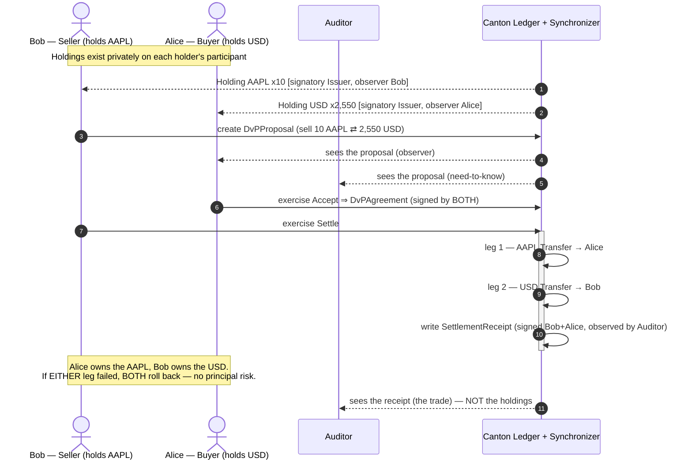
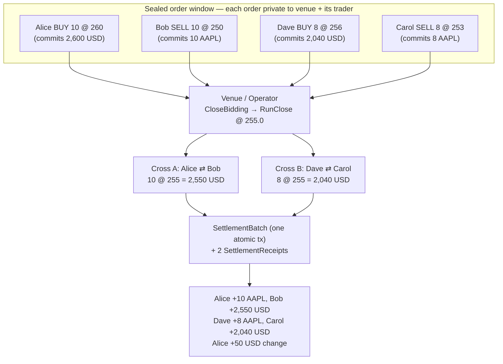

# Private Settlement Desk on Canton

**Atomic Delivery-versus-Payment (DvP) and a sealed-order Market-on-Close auction
between tokenised assets — private by construction.** Institutions swap a
tokenised equity (`DEMO:AAPL`), tokenised cash (`USD`), and wrapped Ethereum
(`cETH`, by [onRails](https://onrails.io)) with **zero principal risk**
(all-or-nothing settlement) and **zero information leakage** (each party sees only
its own side).

> Built for **HackCanton Season 2** — RWA & Business Workflows track + the **cETH
> bounty**. It doubles as a working reference for the exact problem institutional
> digital-asset desks (JPMorgan's Kinexys / JPMD, the Canton Network) exist to
> solve: privacy-preserving, atomic settlement of tokenised assets between known
> counterparties.

> **Build status — honest.** The Daml is written in the portable 2.x/3.x subset
> and compiles with only the SDK's standard library (`daml-prim` / `daml-stdlib`
> / `daml-script`) — **no external `.dar` version pins**. It was **not compiled in
> the authoring environment** (no Daml toolchain there); the first `daml build` /
> `daml test` on a machine with the SDK is what confirms it. See
> [Build & test](#build--test).

---

## The problem

Settling a trade between two institutions is a race between two failures:

- **Principal (Herstatt) risk & T+2.** Someone must move first. If you deliver
  and your counterparty defaults before paying, you are unsecured. The entire
  edifice of escrow agents, CCPs, and multi-day (T+2) settlement exists to paper
  over the fact that delivery and payment are not simultaneous.
- **Big orders move markets.** If the market can *see* a large resting order —
  in a public order book, or in a blockchain mempool — everyone steps in front of
  it. Front-running and MEV on transparent chains are the industrial-scale
  version of this: pending state is public, so it is a searcher's paradise. You
  cannot run an honest large-in-scale auction where the order book leaks.
- **Bridges add risk.** Moving ETH onto another chain to settle usually means a
  bridge — the single most exploited component in crypto.

## The solution

A **settlement desk** where every trade is **atomic** *and* **private**:

- **Atomic DvP.** A Daml transaction commits all-or-nothing. Both legs of a swap
  move in **one** transaction, so a half-settled state is impossible *by
  construction* — principal risk goes to zero, and finality is instant.
- **Privacy = a programmable dark pool.** On Canton a contract is visible only to
  its signatories and observers. A resting order is signed by the venue and the
  one trader who placed it, and by nobody else — so the book is sealed until the
  cross runs. That is a **dark pool / Market-on-Close auction** that a transparent
  chain fundamentally cannot host.
- **No bridge.** `cETH` is a first-class Canton token; settlement is a native
  ledger transfer.

## The owner's angle

I'm a former equities trader (Bookmap, $250M+ traded volume) whose domain was
**Market-on-Close** — the closing auction where the day's largest orders print at
a single official price. MOC works *because* the order book is sealed until the
simultaneous match: reveal a large sell order early and the price gaps against it
before a share trades. `MarketOnClose.daml` is that mechanism rebuilt on Canton —
the auction I traded, now programmable, sealed, and settled atomically on-ledger.

---

## Architecture

Three layers, cleanly separated (the same split Daml Finance uses):

| Layer | File(s) | What it is |
|---|---|---|
| **Instrument** (definition) | `daml/Instrument.daml` | `InstrumentKey {issuer, depository, id, version}` + an `Instrument` template with `kind` / `description` / `referencePrice`. The reference-data layer: *what* an asset is. |
| **Holding** (balance) | `daml/Holding.daml` | `Holding` (issuer-signatory / owner-observer) with `Transfer` / `Split` / `Merge` / `Redeem`, and a `deliverExact` primitive for partial fills. The balance layer: *who holds how much*. |
| **Settlement** (movement) | `daml/Settlement.daml` | Atomic DvP: `DvPProposal → Accept → DvPAgreement → Settle` moves both legs in one tx; `SettlementBatch` + `SettlementReceipt` for the multilateral case and the audit trail. |
| **Market-on-Close** (the app) | `daml/MarketOnClose.daml` | `ClosingAuction` + sealed `SealedOrder`s + `RunClose` — a call auction that batch-settles every cross at one price. |
| **Delegation** | `daml/Agent.daml` | `TradingMandate` — an agent/desk initiates settlements for a principal within a ledger-enforced limit. |

### The seam: Daml / Canton / Ledger API

- **Daml** is the contract language — the templates in `daml/` *are* the business
  logic and the authorization model (who may do what, who may see what).
- The **Canton synchronizer** is the coordination layer: it orders and delivers
  encrypted per-party views between participant nodes and **never sees contract
  data**. Two parties on different participants settle atomically without either
  participant learning the other's book.
- The **Ledger API** (gRPC, mutually-authenticated **mTLS**, JWT-scoped `actAs` /
  `readAs`) is the seam an application or trading system talks to: create a
  proposal, exercise `Settle`, stream transactions. This repo's Daml is exactly
  what sits behind that API.

### The load-bearing design decision

Holdings are signed **only by their issuer** (the holder is an *observer*). That
is what lets a two-leg swap — and every matched leg of an auction — settle in
**one** atomic transaction: each leg re-issues to the new owner using the issuer's
*delegated* authority, so the incoming owner never has to co-sign. Making the
holder a signatory would break single-transaction atomic settlement. Every module
header explains the *why*, not just the *what*.

### The example assets

| Instrument | `kind` | Reference | Role |
|---|---|---|---|
| `DEMO:AAPL` | `Equity` | `referencePrice = 255.0` | the auctioned asset in the MOC demo |
| `USD` | `Cash` | — | the cash leg |
| `cETH` | `CryptoWrapped` | onRails | the crypto delivery leg (the bounty) |

---

## Flow 1 — Atomic bilateral DvP

Alice buys 10 `DEMO:AAPL` from Bob for 2,550 `USD`. Bob (the seller) proposes;
Alice accepts; the settle moves both legs at once. An auditor sees the trade but
not the books; Eve (an outsider) sees nothing.



## Flow 2 — Market-on-Close (sealed auction, batch settle)

Four traders lodge **sealed** orders — no one sees a rival's order. The operator
seals the window and runs the close at one price (255.0); every crossing pair
settles atomically in a single `SettlementBatch`.



No participant saw another's order; there was no market impact and no
front-running; the batch is all-or-nothing.

---

## How it maps to JPMorgan's stack

This is a scale model of institutional tokenised settlement:

| Here | JPMorgan / Kinexys reality |
|---|---|
| `USD` cash leg (`Holding`, `kind = "Cash"`) | **JPMD** / a tokenised deposit as the on-chain cash leg |
| `DEMO:AAPL`, `cETH` asset legs | tokenised securities / MMF shares / wrapped assets |
| `DvPAgreement.Settle` (atomic two-leg) | intraday, atomic DvP with no principal risk |
| `SealedOrder` privacy | confidential order handling / dark liquidity |
| Canton synchronizer + participant privacy | Kinexys' privacy-preserving shared ledger |
| `SettlementReceipt` / `SettlementBatch` | the immutable settlement + audit record |

---

## The cETH bounty (onRails)

`cETH` is a first-class delivery leg. `testAgentInitiatedDvP` settles a real cETH
DvP, and cETH can equally be the asset leg of a Market-on-Close cross. Running the
demo on Devnet with **onRails cETH** drives genuine on-ledger cETH state changes —
mint → transfer → settle — which is exactly what the bounty rewards. Devnet cETH is
requested from onRails (see [DEPLOY.md](./DEPLOY.md)); gas on Devnet is Canton Coin
(free from the tap).

---

## Build & test

### 1. Install the Daml SDK

```bash
curl -sSL https://get.digitalasset.com/install/install.sh | sh -s <version>
daml version          # copy the printed version into daml.yaml → sdk-version
```

`daml.yaml` ships `sdk-version` as a **placeholder** — set it to your installed
version (and, for Devnet, to the Splice/Daml release the onboarding specifies).

### 2. Run the scenarios

```bash
cd hackcanton-ceth-settlement
daml test
```

`daml test` compiles the project and runs every `Script` in `daml/Test.daml`:

- `testInstrumentAndHolding` — publish instruments; mint/transfer/split/merge.
- `testBilateralDvP` — the headline atomic DvP + audit receipt + auditor-can't-see-holdings.
- `testMarketOnClose` — a 4-order sealed auction → one close price → atomic batch settlement, with balances checked.
- `testDarkPoolPrivacy` — an outsider sees nothing; a rival participant can't see another's sealed order.
- `testAtomicRollback` — a bad leg rolls the **whole** settlement back.
- `testAgentInitiatedDvP` — an agent settles cETH within a ledger-enforced mandate.

### 3. Explore interactively

```bash
daml start
```

Builds the DAR, starts a local Canton sandbox, runs `Test:initialize` (allocates
Issuer / Venue / Alice / Bob / Bank / Auditor / Agent / Eve, publishes the
instruments, and seeds a live DvP proposal), and opens **Navigator** at
<http://localhost:7500>. Log in as each party to *see for yourself* what each can
and cannot see — then Accept as Alice and Settle as Bob.

---

## Deploy to Canton Devnet

Deploying the DAR and executing a real settlement is the hackathon's qualifying
requirement. Full step-by-step — including the human-only steps (Devnet
credentials, cETH from the onRails form) — is in **[DEPLOY.md](./DEPLOY.md)**.

---

## Further reading

- **[docs/DAML_FINANCE_INTEGRATION.md](./docs/DAML_FINANCE_INTEGRATION.md)** — the precise mapping of every template to its Daml Finance V4 equivalent, and the documented (low-risk) library swap.
- **[DEPLOY.md](./DEPLOY.md)** — Canton Devnet deployment.
- **[docs/BUSINESS_BRIEF.md](./docs/BUSINESS_BRIEF.md)** — the 1-page RWA brief.
- **[docs/PILOT_PLAN.md](./docs/PILOT_PLAN.md)** — a short pilot plan.
- **[CANTON_RESOURCES.md](./CANTON_RESOURCES.md)** — the official Canton/Daml repos to build on.
- **[JOURNAL.md](./JOURNAL.md)** — the build journal.

## Glossary

- **DvP** — Delivery-versus-Payment: asset leg and cash leg settle atomically.
- **Market-on-Close (MOC)** — a closing call auction where interest prints at one official price.
- **Dark pool** — a venue where the resting order book is not visible pre-trade.
- **cETH** — wrapped Ethereum as a native Canton token (by onRails).
- **Party** — an on-ledger identity (a KYC'd institution or desk).
- **Signatory / Observer / Controller** — Daml's authorization model: *on the hook + can see* / *can see only* / *may pull this lever*.
- **Synchronizer** — Canton's ordering + delivery layer; routes encrypted per-party views, never sees contract data.

---

*Licensed for hackathon and evaluation use. cETH is a product of onRails; Canton
and Daml are products of Digital Asset. This is an independent submission.*
