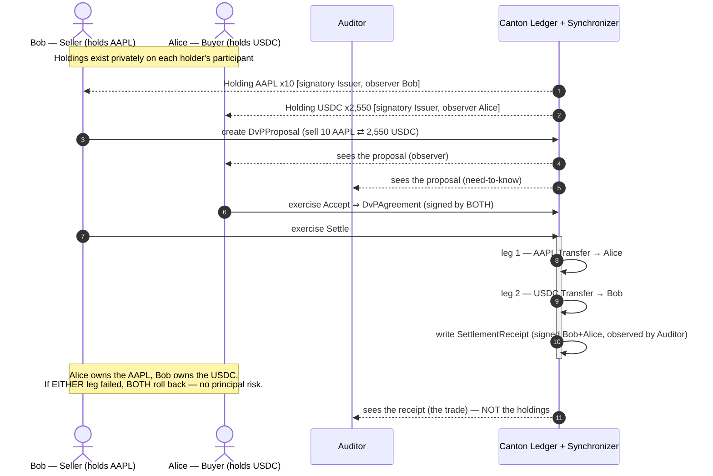
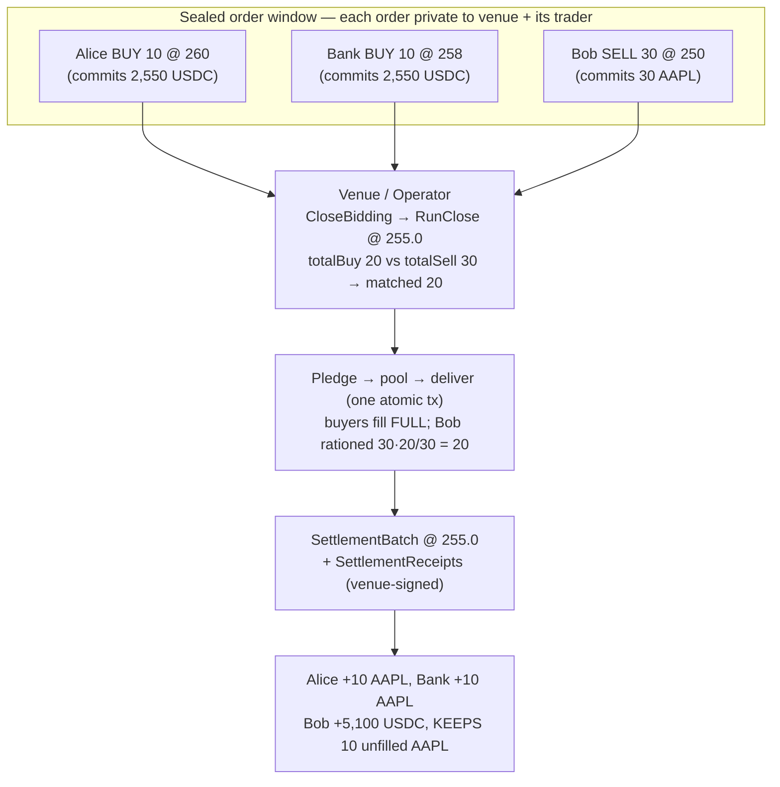
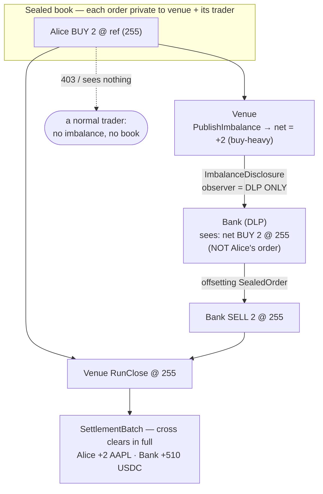

# CrossDesk — the on-chain fund-issuance layer for tokenised assets on Canton

**Atomic in-kind creation & redemption, and a credibly-neutral NAV struck by a
decentralised K-of-N committee — the fund-issuance machinery tokenised assets are
missing.** A tokenised fund is defined as a smart contract: an authorised
participant delivers the basket of underlyings — wrapped Ethereum (`cETH`, by
[onRails](https://onrails.io)), wrapped Bitcoin (`CBTC`, by BitSafe), tokenised
cash (`USDC`) — and receives freshly-minted shares, or hands shares back for the
basket, in **one atomic transaction** with **zero principal risk**. The official
NAV is priced by a sealed, uniform-price **Market-on-Close auction** — private by
construction, so no order leaks and no single party sets the price.

> A Canton **fund-issuance desk** built for **HackCanton Season 2** — the
> on-chain machinery a tokenised fund needs to exist: an in-kind create/redeem
> primary market and a committee-struck NAV, on top of the privacy-preserving,
> atomic **DvP settlement** that institutional digital-asset desks (JPMorgan's
> Kinexys / JPMD, the Canton Network) exist to provide.

> **🌐 Live demo → https://crossdesk-devnet-app.web.app** — the full React desk,
> connected to the **real shared HackCanton devnet node** (NODERS `hackcanton-01`,
> Canton 3.x) via a Cloud Run backend over the Ledger API v2, **settling real
> on-chain transactions**. First live settlement (2026-07-19): an atomic DvP —
> *alice-crossdesk → bob-crossdesk · 10 cETH @ 3,200 USDC* — receipt visible to
> Alice/Bob/Auditor only (sub-transaction privacy on a shared node). See
> [`DEVNET_INTEGRATION.md`](DEVNET_INTEGRATION.md).

> **Provenance (HackCanton S2).** Built **entirely during the hackathon
> window** — the git history is the proof: the first commit (2026-07-11) is
> titled *"Private cETH Settlement Desk — HackCanton Season 2"*, and every line
> since (DvP engine, sealed MOC auction, K-of-N governance committee, in-kind
> ETF/basket engine, the Daml 2.9 → Canton 3.x / Ledger API v2 port, the shared
> devnet-node deployment, and the hosted live demo) landed between July 11 and
> the submission. No pre-existing codebase. Full build log in
> [`DEVNET_INTEGRATION.md`](DEVNET_INTEGRATION.md) and the commit history.

> **Build status.** The Daml is written in the portable 2.x/3.x subset and
> compiles with only the SDK's standard library (`daml-prim` / `daml-stdlib` /
> `daml-script`) — **no external `.dar` version pins**. `daml build` succeeds and
> `daml test` runs green (every `Script` in `daml/Test.daml` passes, with no
> divulgence warnings) on Daml SDK **2.9.4**. The Spring backend also runs against
> Canton 3.x / Ledger API v2 (`backend-devnet/`), deployed on the devnet node.
> See [Run it locally](#run-it-locally) and [`backend-devnet/RUNBOOK.md`](backend-devnet/RUNBOOK.md).

---

## The problem

Thirty-billion-plus dollars of funds have moved on-chain — but the machinery that
makes a fund a *fund* hasn't. You tokenise the asset and inherit the old plumbing:

- **No native primary market.** In-kind creation/redemption — the mechanism that
  keeps a fund glued to its NAV, and the one the SEC approved for crypto ETFs in
  July 2025 — still lives in a TradFi back office, not on the chain the assets
  sit on.
- **No trustworthy on-chain NAV.** The official price is struck off-chain by a
  single administrator you have to trust, and reconciled for weeks. There is no
  credibly-neutral NAV to create, redeem, or mark against.
- **You can't strike that price in the open.** A NAV auction needs a sealed book:
  if the market can *see* the largest resting orders — in a public order book or a
  blockchain mempool — everyone front-runs them (MEV is the industrial-scale
  version). And moving the underlyings across chains to settle means a bridge —
  the single most-exploited component in crypto.

## The solution

**An on-chain fund factory: define a basket, create and redeem it in-kind and
atomically — priced by a NAV no single party can set.**

- **In-kind primary market.** A basket (e.g. `LX1 = 0.10 cETH + 0.01 CBTC` per
  share) is an ordinary tokenised instrument. An authorised participant delivers
  the exact underlyings and receives freshly-minted shares — or burns shares and
  gets the underlyings back — in **one** Daml transaction. Both sides move or
  neither does, so unit-supply and holdings can never drift (`Basket.daml`,
  Flow 4).
- **A committee-struck NAV.** The official price only exists once a **threshold K
  of N** independent members have attested it — provable from the contract's own
  signatures — so no single administrator can set it (`Governance.daml`, Flow 3).
- **Priced by a private, atomic auction.** The mark is produced by a sealed,
  uniform-price **Market-on-Close** cross: on Canton a resting order is visible
  only to the venue and the trader who placed it, so the book is a **programmable
  dark pool** — real price discovery with no front-running (`MarketOnClose.daml`,
  Flow 2). Every matched leg settles all-or-nothing via **atomic DvP**
  (`Settlement.daml`, Flow 1) — zero principal risk, instant finality, no bridge
  (`cETH` and `CBTC` are first-class Canton tokens).

## The owner's angle

I'm a former equities trader (Bookmap, $250M+ traded volume) whose domain was
**Market-on-Close** — the closing auction where the day's largest orders print at
a single official price. MOC works *because* the order book is sealed until the
simultaneous match: reveal a large sell order early and the price gaps against it
before a share trades. `MarketOnClose.daml` is that mechanism rebuilt on Canton —
the auction I traded, now programmable, sealed, and settled atomically on-ledger —
the price-formation engine under CrossDesk's NAV.

---

## Architecture

Three layers, cleanly separated (the same split Daml Finance uses):

| Layer | File(s) | What it is |
|---|---|---|
| **Instrument** (definition) | `daml/Instrument.daml` | `InstrumentKey {issuer, depository, id, version}` + an `Instrument` template with `kind` / `description` / `referencePrice`. The reference-data layer: *what* an asset is. |
| **Holding** (balance) | `daml/Holding.daml` | `Holding` (issuer-signatory / owner-observer) with `Transfer` / `Split` / `Merge` / `Redeem`, and a `deliverExact` primitive for partial fills. The balance layer: *who holds how much*. |
| **Settlement** (movement) | `daml/Settlement.daml` | Atomic DvP: `DvPProposal → Accept → DvPAgreement → Settle` moves both legs in one tx; `SettlementBatch` + `SettlementReceipt` for the multilateral case and the audit trail. |
| **Market-on-Close** (the app) | `daml/MarketOnClose.daml` | `ClosingAuction` + sealed `SealedOrder`s + `RunClose` — a call auction that batch-settles every cross at one price. |
| **Delegation** | `daml/Agent.daml` | `TradingMandate` — an agent/desk initiates settlements for a principal within a ledger-enforced limit. |

### The seam: Daml / Canton / Ledger API

- **Daml** is the contract language — the templates in `daml/` *are* the business
  logic and the authorization model (who may do what, who may see what).
- The **Canton synchronizer** is the coordination layer: it orders and delivers
  encrypted per-party views between participant nodes and **never sees contract
  data**. Two parties on different participants settle atomically without either
  participant learning the other's book.
- The **Ledger API** (gRPC, mutually-authenticated **mTLS**, JWT-scoped `actAs` /
  `readAs`) is the seam an application or trading system talks to: create a
  proposal, exercise `Settle`, stream transactions. This repo's Daml is exactly
  what sits behind that API.

### The load-bearing design decision

Holdings are signed **only by their issuer** (the holder is an *observer*). That
is what lets a two-leg swap — and every matched leg of an auction — settle in
**one** atomic transaction: each leg re-issues to the new owner using the issuer's
*delegated* authority, so the incoming owner never has to co-sign. Making the
holder a signatory would break single-transaction atomic settlement. Every module
header explains the *why*, not just the *what*.

### The example assets

| Instrument | `kind` | Reference | Role |
|---|---|---|---|
| `DEMO:AAPL` | `Equity` | `referencePrice = 255.0` | the auctioned asset in the MOC demo |
| `USDC` | `Cash` | — | the cash leg |
| `cETH` | `CryptoWrapped` | onRails | the crypto delivery leg (wrapped ETH, no bridge) |

---

## Flow 1 — Atomic bilateral DvP

Alice buys 10 `DEMO:AAPL` from Bob for 2,550 `USDC`. Bob (the seller) proposes;
Alice accepts; the settle moves both legs at once. An auditor sees the trade but
not the books; Eve (an outsider) sees nothing.



## Flow 2 — Market-on-Close (sealed auction, uniform-price cross)

Traders lodge **sealed** orders — no one sees a rival's order. The operator seals
the window and runs the close: the auction crosses `min(totalBuy, totalSell)` at
**one uniform price** — the published closing/reference price (255.0) — never a
price the operator picks per fill. If the two sides are unequal, the **heavy side
is rationed pro-rata** and the light side fills in full; the unmatched residual
does not settle. Every fill lands atomically in a single `SettlementBatch`.



No participant saw another's order; every fill printed at the same price with no
market impact and no front-running; the over-subscribed side was rationed fairly;
the batch is all-or-nothing. (`testMarketOnClose` shows a balanced cross;
`testMarketOnCloseImbalance` shows exactly the pro-rata rationing above.)

---

## Flow 2b — Liquidity without leakage — the Designated Liquidity Provider

A sealed auction has one weakness: if the book is lopsided, the heavy side can go
**unfilled**. Real venues solve this by publishing the closing **imbalance** — "the
close is 3,000,000 shares to buy" — to attract offsetting interest. But that is
exactly the leak a dark pool exists to prevent: broadcast the imbalance and
front-runners trade ahead of it, moving the price against the very orders you are
trying to fill.

**The lit-vs-dark tension:**

- A **lit** auction publishes the imbalance to the *whole market* → it attracts
  liquidity, but leaks the book to everyone.
- A **dark** pool leaks nothing → but a lopsided book risks a **no-fill**.

Canton lets you do **both at once**: disclose the *net* imbalance to **one**
designated party — a **Designated Liquidity Provider (DLP)** who commits to offset
it — and to **nobody else**. This is impossible on a transparent chain, where the
pending book (and therefore the imbalance) is visible to everyone the instant an
order lands. On Canton, per-contract visibility makes *selective disclosure* a
first-class ledger effect.

**Who sees what** (all enforced by the ledger, not by the app):

| Party | Sees |
|---|---|
| **A trader** (Alice) | ONLY their own order. Not the book, not the imbalance. |
| **The venue** | The full sealed book (it signs every order) + the imbalance. |
| **The DLP** (one designated party, here `Bank`) | ONLY the **net aggregate** imbalance — side + magnitude. **Never** any individual order or trader identity. |

The venue sets `ClosingAuction.liquidityProvider = Some dlp` when it opens the
auction. `PublishImbalance` computes the signed net (`totalBuy − totalSell`) from
the resting orders and writes an **`ImbalanceDisclosure`** — `signatory operator`,
`observer = the DLP only`. The DLP reads "net **BUY** *N* @ ref", then offsets by
lodging an ordinary `SealedOrder` on the opposite side (as private as any other),
and the cross prints in full.



Verified live (`testDesignatedLiquidityProvider`, and via the REST API):

- as **Alice** → `GET /moc/imbalance` returns **403** ("disclosed only to the DLP
  and the venue"), and her book view shows only her own order;
- as **Bank** (the DLP) → `GET /moc/imbalance` returns **net BUY 2 @ 255**, while
  her *order* view is empty (she sees the aggregate, not Alice's order);
- as the **Venue** → the full book;
- Bank **offsets** (SELL 2) → the imbalance goes **Flat** → the venue runs the close
  and it crosses cleanly (Alice +2 AAPL, Bank +510 USDC, no principal risk).

In the web app, acting **as Bank** surfaces an **"Imbalance · LP View"** panel with
a one-click **Offset** button; no other party — not even the venue — sees that
panel, and a normal trader still cannot see the book at all.

---

## Flow 3 — The decentralised operator (K-of-N committee-attested NAV)

An official price is only trustworthy if the party who strikes it *cannot* strike it
alone. `Governance.daml` models the auction operator as a **decentralised party**: a
standing `OperatorCommittee` of N members with a threshold **K**, and a `NavFixing`
that only exists once **K distinct members have attested** to it. This is the
self-contained analogue of BitSafe / DLC.Link's *Decentralized Party Manager*
(Apache-2.0), whose attestor nodes act as Canton "signing parties" under threshold
governance — reimplemented here at the contract level so it compiles on the bare SDK.

The attestation is built the canonical Daml way — an **accumulating multisignature**:

1. `ProposeFixing` — a member proposes a price; the proposal is signed by that one member.
2. `Confirm` — each further member confirms; the choice archives and re-creates the
   proposal with the confirming member added to **both** the approver list and the
   **signatory set**. The signature set grows one member per transaction.
3. `FinalizeFixing` — once ≥ K members have signed, it mints a `NavFixing` whose
   **signatory set *is* the attestors**. The fix therefore cannot exist without K
   genuine member signatures — provable from the contract itself.

A `ClosingAuction` can be **bound** to a fix (`fixingRef`): `RunClose` then fetches
the `NavFixing` and asserts the printed price equals the attested price and that it
carries ≥ threshold signatures — so the close is provably a committee fix, not one
venue's number. `testThresholdAttestation` proves a single member cannot finalise a
2-of-3; `testCommitteeAttestedClose` proves a bound close prints only at the attested
NAV (and a tampered price aborts the whole cross).

## Flow 4 — The ETF / tokenised-fund builder (in-kind creation & redemption)

`Basket.daml` builds a **tokenised ETF** on the same engine. A basket (e.g.
`LX1 = 0.10 cETH + 0.01 CBTC` per share) is defined by a **creation unit**; a share
is an ordinary `Holding` of the basket instrument, issued by the fund administrator,
and it transfers/prices/settles like any other token.

Creation and redemption are **in-kind and atomic** — the mechanism that keeps an ETF
glued to NAV:

- **Create** — an authorised participant (AP) delivers the exact underlyings and
  receives freshly-minted shares, in **one transaction** (`RequestCreation` →
  `ApproveCreation` → `ProcessCreation`, both parties signing — the same
  propose→approve→settle shape as the DvP engine, reusing `deliverExact`).
- **Redeem** — the reverse: the AP's shares are **burned** and the custody underlyings
  are delivered back, atomically.

NAV per share = Σ (unitsPerShare × close mark); the marks are the committee-attested
prices from Flow 3, so the basket inherits a **credibly-neutral NAV**. `cETH` and
`CBTC` drive the state changes (HackCanton bounty assets). `testCreateThenRedeem`,
`testCreationAtomicRollback`, and `testNavPerShare` prove it end-to-end.

**Try it (with the stack running — see "Run it locally"):**
```bash
# Decentralised operator: a 2-of-3 committee strikes the official cETH close.
COMM=$(curl -s -X POST :8080/api/committee -H 'Content-Type: application/json' \
  -d '{"admin":"Issuer","members":["Venue","Bank","Agent"],"threshold":2}' | jq -r .contractId)
P=$(curl -s -X POST ":8080/api/committee/$COMM/propose" -H 'Content-Type: application/json' \
  -d '{"proposer":"Venue","instrumentId":"cETH","price":2400,"session":"Close"}' | jq -r .contractId)
curl -s -o /dev/null -w '1-of-2 finalize (must fail): HTTP %{http_code}\n' \
  -X POST ":8080/api/fixing/$P/finalize" -H 'Content-Type: application/json' \
  -d '{"proposer":"Venue","publishTo":["Venue"]}'                       # -> 422
P2=$(curl -s -X POST ":8080/api/fixing/$P/confirm" -H 'Content-Type: application/json' \
  -d '{"member":"Bank"}' | jq -r .contractId)
curl -s -X POST ":8080/api/fixing/$P2/finalize" -H 'Content-Type: application/json' \
  -d '{"proposer":"Venue","publishTo":["Venue"]}'                       # -> NavFixing (K-of-N attested)

# ETF builder: define, then create + redeem in-kind.
curl -s -X POST :8080/api/basket -H 'Content-Type: application/json' \
  -d '{"administrator":"Bank","basketId":"LX1","components":[{"instrumentId":"cETH","unitsPerShare":0.1},{"instrumentId":"CBTC","unitsPerShare":0.01}],"participants":["Alice","Bob"]}'
curl -s -X POST :8080/api/basket/create -H 'Content-Type: application/json' \
  -d '{"basketId":"LX1","ap":"Alice","shares":10}'   # Alice: -1.0 cETH -0.1 CBTC, +10 LX1
curl -s ":8080/api/basket/nav?basketId=LX1"          # navPerShare 890 USDC (0.1*2400 + 0.01*65000)
curl -s -X POST :8080/api/basket/redeem -H 'Content-Type: application/json' \
  -d '{"basketId":"LX1","ap":"Alice","shares":4}'    # Alice: +0.4 cETH +0.04 CBTC, LX1 -> 6
```

In the web app, a **Decentralised Operator** card walks the propose → confirm →
finalise attestation (you watch the signatures accumulate), and a **Fund / ETF
Builder** card defines baskets and creates/redeems them in-kind with a live NAV.

---

## How it maps to JPMorgan's stack

This is a scale model of institutional tokenised settlement:

| Here | JPMorgan / Kinexys reality |
|---|---|
| `USDC` cash leg (`Holding`, `kind = "Cash"`) | **JPMD** / a tokenised deposit as the on-chain cash leg |
| `DEMO:AAPL`, `cETH` asset legs | tokenised securities / MMF shares / wrapped assets |
| `DvPAgreement.Settle` (atomic two-leg) | intraday, atomic DvP with no principal risk |
| `SealedOrder` privacy | confidential order handling / dark liquidity |
| `ImbalanceDisclosure` → one DLP only | **selective disclosure** — reveal net flow to a committed market-maker without leaking the book |
| Canton synchronizer + participant privacy | Kinexys' privacy-preserving shared ledger |
| `SettlementReceipt` / `SettlementBatch` | the immutable settlement + audit record |
| `OperatorCommittee` → K-of-N `NavFixing` | a **decentralised price administrator** — the official fix no single party can strike (à la a reference-rate panel) |
| `BasketDefinition` in-kind create/redeem | **tokenised fund / ETF** primary market — Authorized-Participant creation & redemption units |

---

## cETH as a delivery leg (onRails)

`cETH` is a first-class delivery leg. `testAgentInitiatedDvP` settles a real cETH
DvP, and cETH can equally be the asset leg of a Market-on-Close cross. Running the
demo on Devnet with **onRails cETH** drives genuine on-ledger cETH state changes —
mint → transfer → settle — with no bridge. Devnet cETH is requested from onRails
(see [DEPLOY.md](./DEPLOY.md)); gas on Devnet is Canton Coin (free from the tap).

---

## Run it locally

Everything below runs **offline** on a local sandbox with self-issued tokens — no
Devnet access, no credentials, and no coins required.

### 1. Install the Daml SDK

```bash
curl -sSL https://get.daml.com/ | sh -s 2.9.4
daml version          # should list 2.9.4 (matches daml.yaml → sdk-version)
```

### 2. Run the scenarios

```bash
cd hackcanton-ceth-settlement    # the folder name is cosmetic — see the note below
daml test
```

`daml test` compiles the project and runs every `Script` in `daml/Test.daml`
(all pass, no divulgence warnings):

- `testInstrumentAndHolding` — publish instruments; mint/transfer/split/merge.
- `testBilateralDvP` — the headline atomic DvP + audit receipt + auditor-can't-see-holdings.
- `testMarketOnClose` — a 4-order sealed auction → one uniform close price → atomic batch, balances checked.
- `testMarketOnCloseImbalance` — an over-subscribed side is rationed **pro-rata** at the one close price; the residual doesn't settle.
- `testDarkPoolPrivacy` — an outsider sees nothing; a rival participant can't see another's sealed order.
- `testAtomicRollback` — a bad leg rolls the **whole** settlement back.
- `testAgentInitiatedDvP` — an agent settles cETH within a ledger-enforced mandate.
- `testDesignatedLiquidityProvider` — **selective imbalance disclosure**: the DLP (and venue) see the net imbalance; a normal trader does **not**; the DLP sees only the aggregate (not the individual orders); the DLP offsets to clear the cross.

### 3. Explore interactively — the web app (recommended)

The repo ships a **React + TypeScript** front end ([`frontend/`](./frontend)) over
the Spring Boot backend — a simple **Buy / Sell** settlement desk: pick a party,
see your position, **Settle now (DvP)** with a counterparty or **Send to Close
(MOC)** as a sealed anonymous order, and watch **settlement receipts** (with their
on-ledger contract-id hashes) land. All the contract-id plumbing is auto-resolved
server-side, so it reads like a real product — and it's the exact institutional
stack end to end: **React/TS → Spring Boot (Ledger API) → Canton**. Full run steps
(sandbox → backend → React) are in **[run-react.md](./run-react.md)**; in short:

```bash
# 1) ledger:   daml sandbox --port 6900  +  upload DAR  +  run Test:initialize
# 2) backend:  cd backend && LEDGER_PORT=6900 ./gradlew bootRun        # :8080
# 3) web app:  cd frontend && npm install && npm run dev               # :5173
# → open http://localhost:5173
```

### 3b. Or the built-in inspector (Navigator)

```bash
daml start
```

Builds the DAR, starts a local Canton sandbox, runs `Test:initialize` (allocates
Issuer / Venue / Alice / Bob / Bank / Auditor / Agent / Eve, publishes the
instruments, and seeds a live DvP proposal), and opens Daml's generic **Navigator**
inspector at <http://localhost:7500>. Useful for browsing raw contracts per party
to *see* the privacy model — but note Navigator is **deprecated** (removed in Daml
3.0) and its party picker can be flaky with the Canton sandbox, so prefer the
React app above for a real demo.

> **Folder name.** This directory is named `hackcanton-ceth-settlement` for
> historical reasons; nothing depends on it, so you can rename it freely. The Daml
> **package** is `canton-dvp-settlement-desk` (see `daml.yaml`).

---

## Backend (Spring Boot) + Deploy

A production-shaped **Java 17 / Spring Boot 3** service in [`backend/`](./backend)
drives this Daml model over the **Ledger API** (gRPC) using the **Daml Java
Bindings 2.9.4** — the exact institutional stack (Java + Spring Boot + TDD in
front of a Canton settlement engine). REST in, Ledger API commands out.

### What it exposes

| Method + path | Daml action | acts as |
|---|---|---|
| `POST /api/instruments` | create `Instrument` | issuer |
| `POST /api/holdings` | create `Holding` | issuer |
| `GET  /api/holdings?party=` | active `Holding`s visible to a party | — |
| `POST /api/dvp/propose` | create `DvPProposal` | proposer (seller) |
| `POST /api/dvp/{cid}/accept` | `Accept` → `DvPAgreement` | counterparty (buyer) |
| `POST /api/dvp/{cid}/settle` | `Settle` (both legs, atomic) | proposer |
| `POST /api/auction` | create `ClosingAuction` (optional `liquidityProvider`) | operator |
| `POST /api/auction/{cid}/order` | `SubmitOrder` (sealed) | trader |
| `POST /api/auction/{cid}/close` | `CloseBidding` + `RunClose` → `SettlementBatch` | operator |
| `GET  /api/moc/imbalance?instrument=&actingAs=` | net imbalance to the **DLP or venue only** (`403` for a normal trader — enforced by the ledger) | acting party |
| `GET  /api/health` | liveness + which ledger it points at (no ledger call) | — |

### How it's wired

- **Daml Java codegen** — `daml codegen java` (configured in [`daml.yaml`](./daml.yaml))
  emits strongly-typed template classes into `backend/src/main/generated-java`
  (package `com.lucilla.settlement.model`), committed so the Gradle/Docker builds
  need no Daml SDK.
- **`LedgerCommands`** (pure) maps requests → Ledger API Create/Exercise commands;
  **`LedgerService`** submits them under the right `actAs` party and reads active
  contracts back; **`SettlementController`** is the REST surface.
- **Same jar, two ledgers.** `application.yml` (all env-overridable) selects a
  local **sandbox** (`localhost:6865`, plaintext, no auth — the default) or a real
  **Canton participant** (`LEDGER_TLS=true` + `LEDGER_JWT=<bearer>`).
- **TDD.** `./gradlew build` runs JUnit 5 unit tests for the command mapping
  (`LedgerCommandsTest`) and a MockMvc web-slice test (`SettlementControllerTest`)
  — **no ledger required**. A `@Tag("integration")` end-to-end test
  (`LedgerIntegrationIT`) runs a full issue→propose→accept→settle→query flow
  against a live ledger and is **excluded from the default build** (run it with
  `./gradlew integrationTest`, ledger up).

### Run it

```bash
cd backend
./gradlew build            # compile + unit/web tests (no ledger needed)
./gradlew bootRun          # starts on :8080, points at localhost:6865 by default
```

End-to-end against a local sandbox (two-terminal flow, full `curl` walkthrough):
see [`backend/run-local.md`](./backend/run-local.md).

### Containerize

```bash
# multi-stage build (Temurin 21); build from the REPO ROOT:
docker build -f backend/Dockerfile -t canton-dvp-desk:1.0.0 .
docker run -p 8080:8080 -e LEDGER_HOST=host.docker.internal canton-dvp-desk:1.0.0
curl localhost:8080/api/health

# or the app tier + a host sandbox via compose:
docker compose up --build
```

### Deploy on GKE (Helm or plain YAML)

A values-driven **Helm chart** ([`deploy/helm/canton-dvp-desk`](./deploy/helm/canton-dvp-desk))
and equivalent **plain manifests** ([`deploy/k8s`](./deploy/k8s)) deploy the app
tier (Deployment/Service/Ingress/ConfigMap/Secret), with the ledger endpoint +
JWT as config. The copy-paste **[`deploy/GKE_RUNBOOK.md`](./deploy/GKE_RUNBOOK.md)**
covers project + Artifact Registry + cluster + `helm install`, and — importantly —
**cost + teardown** (a GKE control plane is ~$73/mo; delete the cluster to stop
the meter — a demo is a few dollars) plus the honest note that a full production
Canton participant is a separate, license-gated deployment (point the desk at a
Devnet participant or sandbox for the demo).

---

## Share it / deploy to Devnet

**Share the code.** Push this repo to GitHub; anyone can then clone it and run
`daml test` / `daml start` locally with just the SDK — no accounts or coins:

```bash
git clone <your-repo-url> && cd <repo> && daml test
```

**Deploy to Canton Devnet.** To execute a real, networked settlement (and drive
genuine on-ledger cETH), deploy the DAR to Devnet via the
[cn-quickstart](https://github.com/digital-asset/cn-quickstart) path. The
human-only steps — Devnet credentials, and requesting test **cETH** through the
onRails form — are written up step-by-step in **[DEPLOY.md](./DEPLOY.md)**. Gas on
Devnet is Canton Coin, free from the tap.

---

## Further reading

- **[backend/](./backend)** — the Spring Boot desk (REST → Ledger API via the Daml Java bindings), with **[backend/run-local.md](./backend/run-local.md)** for the local sandbox walkthrough.
- **[docs/WHY_JAVA_SPRING.md](./docs/WHY_JAVA_SPRING.md)** — why Java 17 / Spring Boot 3 / the JVM for a long-running settlement service (JIT throughput, one-jar-many-ledgers, TDD without a ledger).
- **[deploy/GKE_RUNBOOK.md](./deploy/GKE_RUNBOOK.md)** — containerize + deploy the app tier on GKE (Helm or plain YAML), with cost + teardown.
- **[docs/DAML_FINANCE_INTEGRATION.md](./docs/DAML_FINANCE_INTEGRATION.md)** — the precise mapping of every template to its Daml Finance V4 equivalent, and the documented (low-risk) library swap.
- **[DEPLOY.md](./DEPLOY.md)** — Canton Devnet deployment.
- **[docs/BUSINESS_BRIEF.md](./docs/BUSINESS_BRIEF.md)** — the 1-page RWA brief.
- **[docs/PILOT_PLAN.md](./docs/PILOT_PLAN.md)** — a short pilot plan.
- **[CANTON_RESOURCES.md](./CANTON_RESOURCES.md)** — the official Canton/Daml repos to build on.
- **[JOURNAL.md](./JOURNAL.md)** — the build journal.

## Glossary

- **DvP** — Delivery-versus-Payment: asset leg and cash leg settle atomically.
- **Market-on-Close (MOC)** — a closing call auction where interest prints at one official price.
- **Dark pool** — a venue where the resting order book is not visible pre-trade.
- **cETH** — wrapped Ethereum as a native Canton token (by onRails).
- **Party** — an on-ledger identity (a KYC'd institution or desk).
- **Signatory / Observer / Controller** — Daml's authorization model: *on the hook + can see* / *can see only* / *may pull this lever*.
- **Synchronizer** — Canton's ordering + delivery layer; routes encrypted per-party views, never sees contract data.

---

*A personal learning/demo project, for evaluation use. cETH is a product of
onRails; Canton and Daml are products of Digital Asset. Independent and
unaffiliated.*
