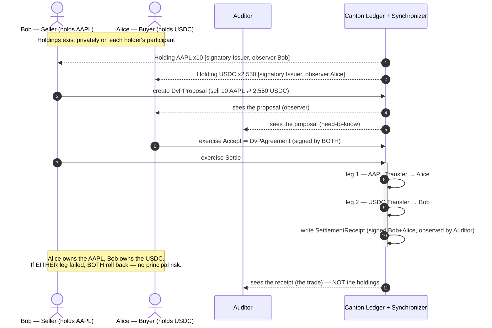
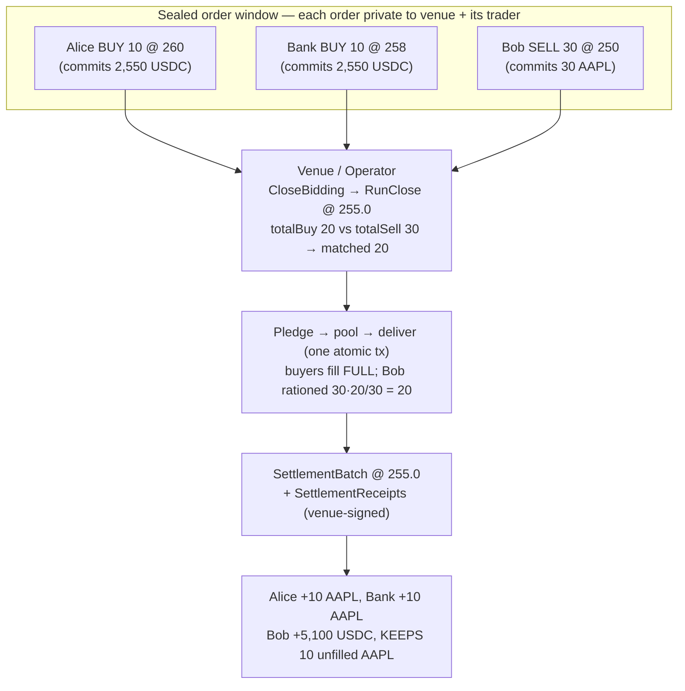

# Canton DvP Settlement Desk

**Atomic Delivery-versus-Payment (DvP) and a sealed-order Market-on-Close auction
between tokenised assets — private by construction.** Two institutions swap a
tokenised equity (`DEMO:AAPL`), tokenised cash (`USDC`), and wrapped Ethereum
(`cETH`, by [onRails](https://onrails.io)) with **zero principal risk**
(all-or-nothing settlement) and **zero information leakage** (each party sees only
its own side).

> A Canton settlement desk I built to learn and demo the platform — a working
> reference for the exact problem institutional digital-asset desks (JPMorgan's
> Kinexys / JPMD, the Canton Network) exist to solve: privacy-preserving, atomic
> settlement of tokenised assets between known counterparties. It is not a
> submission to anything; it's a hands-on model of the real workflow.

> **Build status.** The Daml is written in the portable 2.x/3.x subset and
> compiles with only the SDK's standard library (`daml-prim` / `daml-stdlib` /
> `daml-script`) — **no external `.dar` version pins**. `daml build` succeeds and
> `daml test` runs green (every `Script` in `daml/Test.daml` passes, with no
> divulgence warnings) on Daml SDK **2.9.4**. See [Run it locally](#run-it-locally).

---

## The problem

Settling a trade between two institutions is a race between two failures:

- **Principal (Herstatt) risk & T+2.** Someone must move first. If you deliver
  and your counterparty defaults before paying, you are unsecured. The entire
  edifice of escrow agents, CCPs, and multi-day (T+2) settlement exists to paper
  over the fact that delivery and payment are not simultaneous.
- **Big orders move markets.** If the market can *see* a large resting order —
  in a public order book, or in a blockchain mempool — everyone steps in front of
  it. Front-running and MEV on transparent chains are the industrial-scale
  version of this: pending state is public, so it is a searcher's paradise. You
  cannot run an honest large-in-scale auction where the order book leaks.
- **Bridges add risk.** Moving ETH onto another chain to settle usually means a
  bridge — the single most exploited component in crypto.

## The solution

A **settlement desk** where every trade is **atomic** *and* **private**:

- **Atomic DvP.** A Daml transaction commits all-or-nothing. Both legs of a swap
  move in **one** transaction, so a half-settled state is impossible *by
  construction* — principal risk goes to zero, and finality is instant.
- **Privacy = a programmable dark pool.** On Canton a contract is visible only to
  its signatories and observers. A resting order is signed by the venue and the
  one trader who placed it, and by nobody else — so the book is sealed until the
  cross runs. That is a **dark pool / Market-on-Close auction** that a transparent
  chain fundamentally cannot host.
- **No bridge.** `cETH` is a first-class Canton token; settlement is a native
  ledger transfer.

## The owner's angle

I'm a former equities trader (Bookmap, $250M+ traded volume) whose domain was
**Market-on-Close** — the closing auction where the day's largest orders print at
a single official price. MOC works *because* the order book is sealed until the
simultaneous match: reveal a large sell order early and the price gaps against it
before a share trades. `MarketOnClose.daml` is that mechanism rebuilt on Canton —
the auction I traded, now programmable, sealed, and settled atomically on-ledger.

---

## Architecture

Three layers, cleanly separated (the same split Daml Finance uses):

| Layer | File(s) | What it is |
|---|---|---|
| **Instrument** (definition) | `daml/Instrument.daml` | `InstrumentKey {issuer, depository, id, version}` + an `Instrument` template with `kind` / `description` / `referencePrice`. The reference-data layer: *what* an asset is. |
| **Holding** (balance) | `daml/Holding.daml` | `Holding` (issuer-signatory / owner-observer) with `Transfer` / `Split` / `Merge` / `Redeem`, and a `deliverExact` primitive for partial fills. The balance layer: *who holds how much*. |
| **Settlement** (movement) | `daml/Settlement.daml` | Atomic DvP: `DvPProposal → Accept → DvPAgreement → Settle` moves both legs in one tx; `SettlementBatch` + `SettlementReceipt` for the multilateral case and the audit trail. |
| **Market-on-Close** (the app) | `daml/MarketOnClose.daml` | `ClosingAuction` + sealed `SealedOrder`s + `RunClose` — a call auction that batch-settles every cross at one price. |
| **Delegation** | `daml/Agent.daml` | `TradingMandate` — an agent/desk initiates settlements for a principal within a ledger-enforced limit. |

### The seam: Daml / Canton / Ledger API

- **Daml** is the contract language — the templates in `daml/` *are* the business
  logic and the authorization model (who may do what, who may see what).
- The **Canton synchronizer** is the coordination layer: it orders and delivers
  encrypted per-party views between participant nodes and **never sees contract
  data**. Two parties on different participants settle atomically without either
  participant learning the other's book.
- The **Ledger API** (gRPC, mutually-authenticated **mTLS**, JWT-scoped `actAs` /
  `readAs`) is the seam an application or trading system talks to: create a
  proposal, exercise `Settle`, stream transactions. This repo's Daml is exactly
  what sits behind that API.

### The load-bearing design decision

Holdings are signed **only by their issuer** (the holder is an *observer*). That
is what lets a two-leg swap — and every matched leg of an auction — settle in
**one** atomic transaction: each leg re-issues to the new owner using the issuer's
*delegated* authority, so the incoming owner never has to co-sign. Making the
holder a signatory would break single-transaction atomic settlement. Every module
header explains the *why*, not just the *what*.

### The example assets

| Instrument | `kind` | Reference | Role |
|---|---|---|---|
| `DEMO:AAPL` | `Equity` | `referencePrice = 255.0` | the auctioned asset in the MOC demo |
| `USDC` | `Cash` | — | the cash leg |
| `cETH` | `CryptoWrapped` | onRails | the crypto delivery leg (wrapped ETH, no bridge) |

---

## Flow 1 — Atomic bilateral DvP

Alice buys 10 `DEMO:AAPL` from Bob for 2,550 `USDC`. Bob (the seller) proposes;
Alice accepts; the settle moves both legs at once. An auditor sees the trade but
not the books; Eve (an outsider) sees nothing.



## Flow 2 — Market-on-Close (sealed auction, uniform-price cross)

Traders lodge **sealed** orders — no one sees a rival's order. The operator seals
the window and runs the close: the auction crosses `min(totalBuy, totalSell)` at
**one uniform price** — the published closing/reference price (255.0) — never a
price the operator picks per fill. If the two sides are unequal, the **heavy side
is rationed pro-rata** and the light side fills in full; the unmatched residual
does not settle. Every fill lands atomically in a single `SettlementBatch`.



No participant saw another's order; every fill printed at the same price with no
market impact and no front-running; the over-subscribed side was rationed fairly;
the batch is all-or-nothing. (`testMarketOnClose` shows a balanced cross;
`testMarketOnCloseImbalance` shows exactly the pro-rata rationing above.)

---

## How it maps to JPMorgan's stack

This is a scale model of institutional tokenised settlement:

| Here | JPMorgan / Kinexys reality |
|---|---|
| `USDC` cash leg (`Holding`, `kind = "Cash"`) | **JPMD** / a tokenised deposit as the on-chain cash leg |
| `DEMO:AAPL`, `cETH` asset legs | tokenised securities / MMF shares / wrapped assets |
| `DvPAgreement.Settle` (atomic two-leg) | intraday, atomic DvP with no principal risk |
| `SealedOrder` privacy | confidential order handling / dark liquidity |
| Canton synchronizer + participant privacy | Kinexys' privacy-preserving shared ledger |
| `SettlementReceipt` / `SettlementBatch` | the immutable settlement + audit record |

---

## cETH as a delivery leg (onRails)

`cETH` is a first-class delivery leg. `testAgentInitiatedDvP` settles a real cETH
DvP, and cETH can equally be the asset leg of a Market-on-Close cross. Running the
demo on Devnet with **onRails cETH** drives genuine on-ledger cETH state changes —
mint → transfer → settle — with no bridge. Devnet cETH is requested from onRails
(see [DEPLOY.md](./DEPLOY.md)); gas on Devnet is Canton Coin (free from the tap).

---

## Run it locally

Everything below runs **offline** on a local sandbox with self-issued tokens — no
Devnet access, no credentials, and no coins required.

### 1. Install the Daml SDK

```bash
curl -sSL https://get.daml.com/ | sh -s 2.9.4
daml version          # should list 2.9.4 (matches daml.yaml → sdk-version)
```

### 2. Run the scenarios

```bash
cd hackcanton-ceth-settlement    # the folder name is cosmetic — see the note below
daml test
```

`daml test` compiles the project and runs every `Script` in `daml/Test.daml`
(all pass, no divulgence warnings):

- `testInstrumentAndHolding` — publish instruments; mint/transfer/split/merge.
- `testBilateralDvP` — the headline atomic DvP + audit receipt + auditor-can't-see-holdings.
- `testMarketOnClose` — a 4-order sealed auction → one uniform close price → atomic batch, balances checked.
- `testMarketOnCloseImbalance` — an over-subscribed side is rationed **pro-rata** at the one close price; the residual doesn't settle.
- `testDarkPoolPrivacy` — an outsider sees nothing; a rival participant can't see another's sealed order.
- `testAtomicRollback` — a bad leg rolls the **whole** settlement back.
- `testAgentInitiatedDvP` — an agent settles cETH within a ledger-enforced mandate.

### 3. Explore interactively (Navigator UI)

```bash
daml start
```

Builds the DAR, starts a local Canton sandbox, runs `Test:initialize` (allocates
Issuer / Venue / Alice / Bob / Bank / Auditor / Agent / Eve, publishes the
instruments, and seeds a live DvP proposal), and opens **Navigator** at
<http://localhost:7500>. Log in as each party to *see for yourself* what each can
and cannot see — then Accept as Alice and Settle as Bob. All still offline, on
self-issued tokens.

> **Folder name.** This directory is named `hackcanton-ceth-settlement` for
> historical reasons; nothing depends on it, so you can rename it freely. The Daml
> **package** is `canton-dvp-settlement-desk` (see `daml.yaml`).

---

## Backend (Spring Boot) + Deploy

A production-shaped **Java 17 / Spring Boot 3** service in [`backend/`](./backend)
drives this Daml model over the **Ledger API** (gRPC) using the **Daml Java
Bindings 2.9.4** — the exact institutional stack (Java + Spring Boot + TDD in
front of a Canton settlement engine). REST in, Ledger API commands out.

### What it exposes

| Method + path | Daml action | acts as |
|---|---|---|
| `POST /api/instruments` | create `Instrument` | issuer |
| `POST /api/holdings` | create `Holding` | issuer |
| `GET  /api/holdings?party=` | active `Holding`s visible to a party | — |
| `POST /api/dvp/propose` | create `DvPProposal` | proposer (seller) |
| `POST /api/dvp/{cid}/accept` | `Accept` → `DvPAgreement` | counterparty (buyer) |
| `POST /api/dvp/{cid}/settle` | `Settle` (both legs, atomic) | proposer |
| `POST /api/auction` | create `ClosingAuction` | operator |
| `POST /api/auction/{cid}/order` | `SubmitOrder` (sealed) | trader |
| `POST /api/auction/{cid}/close` | `CloseBidding` + `RunClose` → `SettlementBatch` | operator |
| `GET  /api/health` | liveness + which ledger it points at (no ledger call) | — |

### How it's wired

- **Daml Java codegen** — `daml codegen java` (configured in [`daml.yaml`](./daml.yaml))
  emits strongly-typed template classes into `backend/src/main/generated-java`
  (package `com.lucilla.settlement.model`), committed so the Gradle/Docker builds
  need no Daml SDK.
- **`LedgerCommands`** (pure) maps requests → Ledger API Create/Exercise commands;
  **`LedgerService`** submits them under the right `actAs` party and reads active
  contracts back; **`SettlementController`** is the REST surface.
- **Same jar, two ledgers.** `application.yml` (all env-overridable) selects a
  local **sandbox** (`localhost:6865`, plaintext, no auth — the default) or a real
  **Canton participant** (`LEDGER_TLS=true` + `LEDGER_JWT=<bearer>`).
- **TDD.** `./gradlew build` runs JUnit 5 unit tests for the command mapping
  (`LedgerCommandsTest`) and a MockMvc web-slice test (`SettlementControllerTest`)
  — **no ledger required**. A `@Tag("integration")` end-to-end test
  (`LedgerIntegrationIT`) runs a full issue→propose→accept→settle→query flow
  against a live ledger and is **excluded from the default build** (run it with
  `./gradlew integrationTest`, ledger up).

### Run it

```bash
cd backend
./gradlew build            # compile + unit/web tests (no ledger needed)
./gradlew bootRun          # starts on :8080, points at localhost:6865 by default
```

End-to-end against a local sandbox (two-terminal flow, full `curl` walkthrough):
see [`backend/run-local.md`](./backend/run-local.md).

### Containerize

```bash
# multi-stage build (Temurin 21); build from the REPO ROOT:
docker build -f backend/Dockerfile -t canton-dvp-desk:1.0.0 .
docker run -p 8080:8080 -e LEDGER_HOST=host.docker.internal canton-dvp-desk:1.0.0
curl localhost:8080/api/health

# or the app tier + a host sandbox via compose:
docker compose up --build
```

### Deploy on GKE (Helm or plain YAML)

A values-driven **Helm chart** ([`deploy/helm/canton-dvp-desk`](./deploy/helm/canton-dvp-desk))
and equivalent **plain manifests** ([`deploy/k8s`](./deploy/k8s)) deploy the app
tier (Deployment/Service/Ingress/ConfigMap/Secret), with the ledger endpoint +
JWT as config. The copy-paste **[`deploy/GKE_RUNBOOK.md`](./deploy/GKE_RUNBOOK.md)**
covers project + Artifact Registry + cluster + `helm install`, and — importantly —
**cost + teardown** (a GKE control plane is ~$73/mo; delete the cluster to stop
the meter — a demo is a few dollars) plus the honest note that a full production
Canton participant is a separate, license-gated deployment (point the desk at a
Devnet participant or sandbox for the demo).

---

## Share it / deploy to Devnet

**Share the code.** Push this repo to GitHub; anyone can then clone it and run
`daml test` / `daml start` locally with just the SDK — no accounts or coins:

```bash
git clone <your-repo-url> && cd <repo> && daml test
```

**Deploy to Canton Devnet.** To execute a real, networked settlement (and drive
genuine on-ledger cETH), deploy the DAR to Devnet via the
[cn-quickstart](https://github.com/digital-asset/cn-quickstart) path. The
human-only steps — Devnet credentials, and requesting test **cETH** through the
onRails form — are written up step-by-step in **[DEPLOY.md](./DEPLOY.md)**. Gas on
Devnet is Canton Coin, free from the tap.

---

## Further reading

- **[backend/](./backend)** — the Spring Boot desk (REST → Ledger API via the Daml Java bindings), with **[backend/run-local.md](./backend/run-local.md)** for the local sandbox walkthrough.
- **[deploy/GKE_RUNBOOK.md](./deploy/GKE_RUNBOOK.md)** — containerize + deploy the app tier on GKE (Helm or plain YAML), with cost + teardown.
- **[docs/DAML_FINANCE_INTEGRATION.md](./docs/DAML_FINANCE_INTEGRATION.md)** — the precise mapping of every template to its Daml Finance V4 equivalent, and the documented (low-risk) library swap.
- **[DEPLOY.md](./DEPLOY.md)** — Canton Devnet deployment.
- **[docs/BUSINESS_BRIEF.md](./docs/BUSINESS_BRIEF.md)** — the 1-page RWA brief.
- **[docs/PILOT_PLAN.md](./docs/PILOT_PLAN.md)** — a short pilot plan.
- **[CANTON_RESOURCES.md](./CANTON_RESOURCES.md)** — the official Canton/Daml repos to build on.
- **[JOURNAL.md](./JOURNAL.md)** — the build journal.

## Glossary

- **DvP** — Delivery-versus-Payment: asset leg and cash leg settle atomically.
- **Market-on-Close (MOC)** — a closing call auction where interest prints at one official price.
- **Dark pool** — a venue where the resting order book is not visible pre-trade.
- **cETH** — wrapped Ethereum as a native Canton token (by onRails).
- **Party** — an on-ledger identity (a KYC'd institution or desk).
- **Signatory / Observer / Controller** — Daml's authorization model: *on the hook + can see* / *can see only* / *may pull this lever*.
- **Synchronizer** — Canton's ordering + delivery layer; routes encrypted per-party views, never sees contract data.

---

*A personal learning/demo project, for evaluation use. cETH is a product of
onRails; Canton and Daml are products of Digital Asset. Independent and
unaffiliated.*
