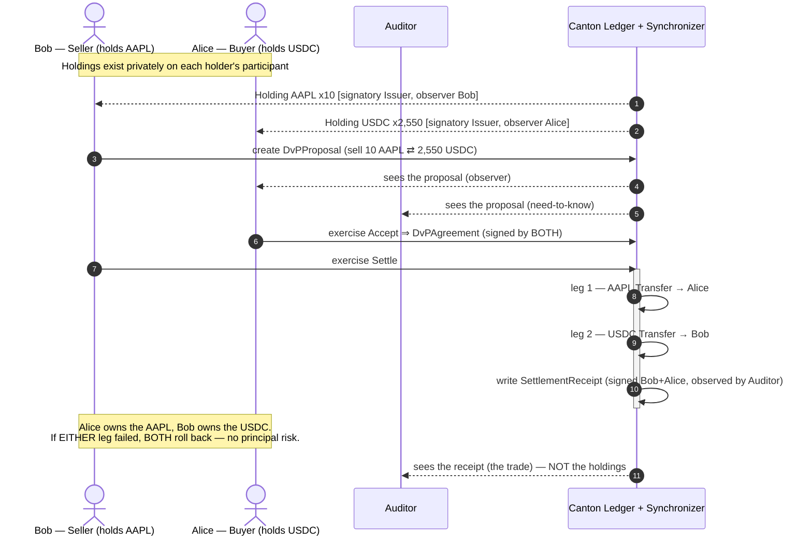
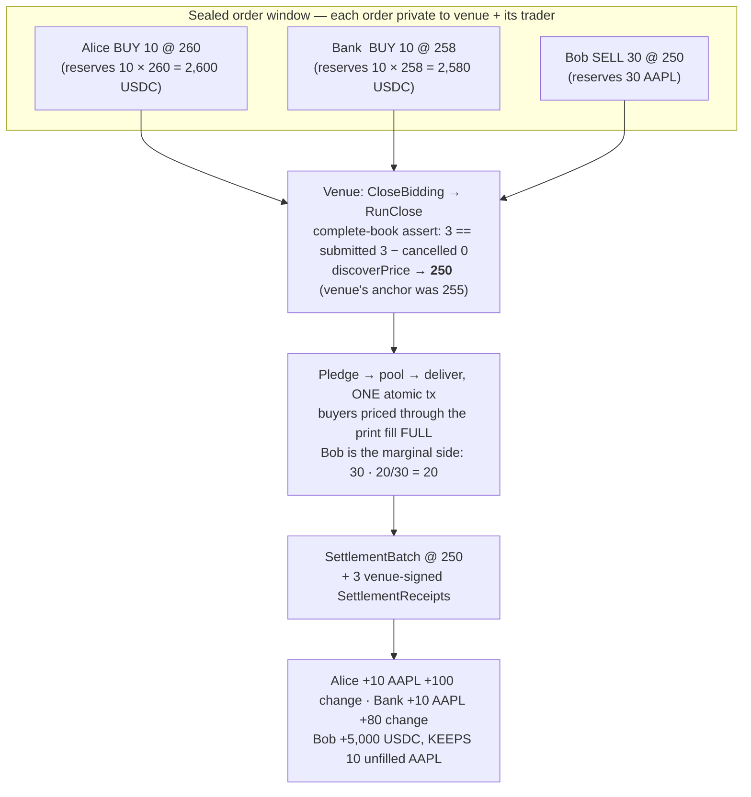
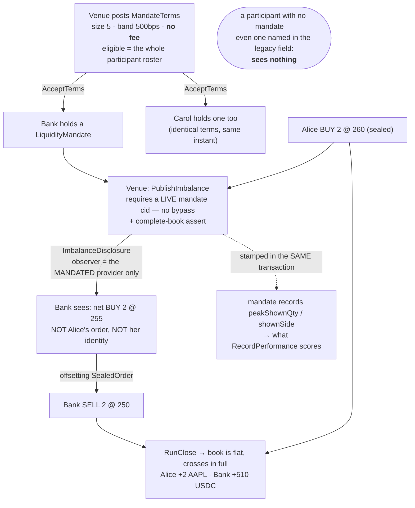

# CrossDesk — a sealed closing auction that discovers its own price, on Canton

> **Source-available, not open source.** This is a commercial product, published so it can be read.
> You may read, fork and evaluate it; you may **not** run it in production, operate it as a service,
> build a derivative product from it, or redistribute it without a written licence. See
> [`LICENSE`](LICENSE), and [`NOTICE`](NOTICE) for the Apache-2.0 packages vendored in `deps/`.
> Licensing enquiries: **s.borjas@lucilla.ca**
>
> **Start here:** [`docs/STATUS_AND_ROADMAP.md`](docs/STATUS_AND_ROADMAP.md) — what this is for,
> what is verified, what is not, and what happens next.
> Won **Best Financial Application**, HackCanton Season 2 Grand Final, 5 August 2026.
>
> ⚠️ Two things this repository does **not** claim: that anything here has been run end to end in its
> current state (the test suites pass; no sandbox has been driven), and that the demo fund holds real
> cBTC (4.16 real cBTC was claimed through the CIP-56 registry flow and is held **separately**; the
> fund's own cBTC and cETH legs are self-issued test assets).

## The product, as of 2 September 2026 — start here if you want to use it

CrossDesk is now two things, and neither is an exchange:

1. **A benchmark administrator** for tokenised assets on Canton that no administrator covers. It
   proposes a price at a scheduled time, has a K-of-N committee of parties with money on the mark
   attest it on-ledger, and publishes it with its tier, age and signers.
2. **A transfer agent** for funds that reference those fixings: creation and redemption of fund
   shares in kind, at the attested NAV, atomically, by authorised participants.

Everything below runs today against a **hosted Canton sandbox**, not a network participant. The
sandbox reseeds on every restart. Nothing here is a regulated benchmark, and the site says so.

| Surface | URL | Who |
|---|---|---|
| Site: benchmarks, methodology, governance, licensing, regulatory | https://crossdesk-devnet-app.web.app | public |
| Public API: `GET /api/benchmarks`, `/api/benchmarks/{id}`, `/api/series/{id}` (+`.csv`), `/api/methodology`, `/api/signer-protocol`, `/api/fixing-schedule` | same host | licensees, anyone |
| App: sign in, role portals | https://crossdesk-devnet-app.web.app/desk/login | signers, APs, fund admins, auditors, admin |
| Operator desk (the original one-page desk) | `/desk/ops` | admin |

**Roles and what each sees after sign-in** (Firebase Authentication; the backend maps email → role,
party, seat in `backend/src/main/resources/users.yml`):

- **signer** (seat `issuer`, `lender` or `venue`, per instrument) — `/desk/sign`: open proposals for
  its instruments with its own seat's named conditions, Confirm / Refuse-with-reason (the venue
  attaches its traded range; the ledger refuses a range that excludes the price), history, and
  Settings: webhook URL + secret, notification email, tolerances, an API key so a machine signs
  instead of a person.
- **ap** (authorised participant) — `/desk/ap`: funds, last official NAV and indicative, the units
  delivered or received for N shares, fee, cutoff, Create / Redeem, receipts.
- **fund_admin** — `/desk/fund`: NAV series, shares outstanding, create/redeem log, fees.
- **admin** — `/desk/admin`: strike schedule per benchmark and Strike now, committee roster, users
  and roles, events with CSV export, fallback status; plus a **View as** switcher that runs the app
  as any other user (`X-Act-As`, logged as an event).
- **auditor** — `/desk/audit`: everything, read-only.

**The fixing lifecycle in production.** Scheduler proposes at the strike time (16:00 London by
default; benchmark print × last attested factor for a wrapped asset, Σ units × marks for a fund) →
every seat is notified (signed webhook, email, in-app) → each seat's service or user confirms a
checklist of facts only it can see, or refuses naming the condition → re-strike inside the window →
finalize at K → funds re-mark → series row published with tier 1. If K is not reached: tier 3
carries benchmark × last factor automatically, tier 4 carries the prior fixing flagged, tier 5
publishes a gap. Tier 2 (alternate seats) is a stub. Every step is an event; the audit export is
those events.

**Sandbox identities** (also Firebase users; passwords are local, not in the repo): admin
`s.borjas@lucilla.ca`; signers `issuer@`, `lender@`, `venue@sandbox.crossdesk` (parties Issuer,
Bank, Venue); APs `alice@`, `bob@sandbox.crossdesk`; `fund@sandbox.crossdesk` (fund admin, party
Bank); `auditor@sandbox.crossdesk`. With `AUTH_MODE=sandbox` on the backend the header
`X-Sandbox-User: <email>` stands in for a token, which is how the hosted demo currently runs.

**What is not done**, in the order it matters: a Canton Network participant (the standing blocker);
a real committee (no institution has signed a fixing); issuer and lender claims are recorded, not
verified — only the venue's range is ledger-enforced; alternate-seat fallback (tier 2); a private
`Contribution` template; the reference signer service as a shippable container; legal pages;
benchmark-administrator recognition. See [`docs/PRODUCT-PLAN.md`](docs/PRODUCT-PLAN.md) for the
build plan and the API contract, and [`docs/PRODUCTION_CHECKLIST.md`](docs/PRODUCTION_CHECKLIST.md).

---

**Traders lodge sealed orders nobody else can see. At the close the venue uncrosses
the whole book in one atomic transaction: it *discovers* a single clearing price
from the orders themselves, allocates by price priority, moves every leg, and
issues a receipt per fill. Either the entire close prints, or none of it does.**

That price is the thing a tokenised fund is missing — an official mark no single
party sets — so the same engine also carries the rest of the fund-issuance
machinery: in-kind creation/redemption of a basket, and a K-of-N committee that
attests the NAV the auction is anchored to.

> A Canton **fund-issuance desk** built for **HackCanton Season 2** — the
> on-chain machinery a tokenised fund needs to exist: price formation, an in-kind
> create/redeem primary market, and a committee-struck NAV, on top of the
> privacy-preserving, atomic **DvP settlement** that institutional digital-asset
> desks (JPMorgan's Kinexys / JPMD, the Canton Network) exist to provide.

**The reason it has to be Canton:** on a public chain the mempool *is* the book.
Every resting order is visible before it executes, which is the exact opposite of
a sealed auction. On Canton a contract is visible only to its signatories and
observers, so a **sealed order is a native primitive**.

---

## What changed after the finalist feedback — start here

The Season 2 finalist feedback was:

> *"Strong market-structure thinking and a technically credible Canton build —
> sealed auction, net-imbalance disclosure, a multi-party NAV process and atomic
> DvP demonstrated on DevNet. To sharpen before the final: cBTC/cETH are currently
> self-issued stand-ins (move to CIP-56), and the auction crosses at an
> operator-supplied reference price rather than discovering the official open/close
> from the order book — add deterministic price selection and complete-order
> commitments, and show one real token-standard DvP."*

Four criticisms. Here is each one, what was done, and where to check it in about
thirty seconds:

| The criticism | What now happens | Check it |
|---|---|---|
| **"crosses at an operator-supplied reference price"** | `RunClose` calls a **pure** `discoverPrice` over the sealed book: candidates are every distinct limit in the book plus the anchor; pick max executable volume → min \|imbalance\| → market pressure → mixed-surplus boundary → nearest anchor. **The anchor is demoted from the answer to the last-resort tie-break.** | `daml/MarketOnClose.daml` → `discoverPrice`; `Test:testPriceDiscoveryUnit` (no ledger), `Test:testPriceDiscoveryBeatsReference`, `Test:testMarketOnCloseImbalance` (prints 250, **not** the venue's 255) |
| **"add deterministic price selection"** | The ladder is total — exactly one answer for a given (anchor, book), with no operator input anywhere in the chain — because every Canton validator re-executes the choice body and must agree. Ties are settled by published rules (Xetra T7 §11.1.1 with Euronext's nearest-the-reference final tie-break), not by list order. | `discoverPrice`'s tie-break comment block; `Test:testMixedSurplusTieBreak`, `Test:testAllocationUnit` |
| **"complete-order commitments"** | `ClosingAuction` counts `submittedCount` / `cancelledCount`; `RunClose` asserts `length buyOrders + length sellOrders == submittedCount − cancelledCount` **and** that no order id appears twice. An omitted order must be a real, on-ledger cancellation the trader can see. | `daml/MarketOnClose.daml` → `RunClose` (the two `assertMsg`s at the top); `Test:testCompleteBookRequired`, `Test:testCancellationKeepsTheBookHonest` |
| **"cBTC/cETH are self-issued stand-ins (move to CIP-56) … show one real token-standard DvP"** | `daml/TokenStandardDvp.daml` implements **six** official Token Standard interfaces and runs a **two-leg atomic DvP over `AllocationRequest`** — cETH against cBTC. The official `splice-api-token-*-v1` DARs are vendored unmodified into `deps/`. **The auction path is still the legacy self-issued layer** and we say so, loudly, below. | `daml/TokenStandardDvp.daml`, `daml/TokenStandardTest.daml`, `daml.yaml` → `data-dependencies`, and `docs/TOKEN_STANDARD_DVP.md` |

Then more was added on top, because the feedback exposed the shape of the
problem rather than just the instances:

- **The unpriced MOC order type.** `limitPrice` is now `Optional Decimal`. `None`
  is a market-on-close: eligible at every price, ranked ahead of every limit
  order, never cancelled for being away from the cross. The overwhelming majority
  of real closing volume is unpriced; a venue that models only price *setters* is
  modelling the smaller half of a market.
- **A price collar that clamps instead of aborting.** `max($0.50, 10% of anchor)`
  (Nasdaq's construction, floor and percentage both). A print outside the band is
  pulled to the nearer boundary and the book is **re-crossed there** — it does not
  cancel everyone else's close. That bound is also what makes an unpriced buy
  fundable at submission time.
- **A contestable liquidity mandate.** Imbalance disclosure used to follow a party
  the venue named in a field, which owed nothing. It now requires a live,
  accepted, obligated `LiquidityMandate` — an open offer any registered
  participant may take, at **no fee**, many at once.
- **Accruing NAV.** The committee attests base / rate / day-count / as-of, and the
  ledger derives the value continuously, so a fixing does not go stale the moment
  it is struck.
- **A continuous session.** `docs/HOW_IT_WORKS.md` used to list "there is no
  continuous session here" as a known limitation. There is one now:
  `daml/ContinuousBook.daml` is a **price–time-priority limit order book** where
  interest rests between auctions, matched by price then time and settled at the
  **maker's** posted price in a single atomic sweep. It matters structurally — a
  closing auction inherits its price from the resting ladder rather than inventing
  one, which is why a venue with only an auction has to fall back on its own
  reference. Same privacy property as the sealed book, and sharper: a
  `RestingOrder` has **no observers at all**, so a trader sees only its own orders
  and *even the auditor* sees none of them while they rest — while every fill
  prints to a **public, anonymous** tape. Dark pre-trade, lit post-trade.
  **28 scenarios** in `daml/ContinuousBookTest.daml`, and it is wired end-to-end:
  `POST /api/book/order` → the *Continuous Session* panel in the desk.
- **Leverage — cash-settled perpetuals.** The desk could price a fund and issue
  its shares in kind, but nobody could take a *view* on that fund without
  holding it, or hedge one they held. Creation and redemption move real
  underlyings, so an arbitrageur has to fund the whole basket before it can act;
  a holder who wants less exposure for a week had no instrument at all.
  `daml/Perpetual.daml` is that instrument: post USDC, go long or short up to
  the market's `maxLeverage`, marked continuously against an index. **A perp on
  a fund cannot index on an attested mark, because a fund has none.** Its value
  is derived from what it holds. So the index is the fund's NAV per share,
  computed from its components' attested marks, and it therefore inherits the
  committee's signatures instead of inventing a new authority. An unmarked
  component yields no index at all: a fund you cannot value is a fund you cannot
  lever. That matters more here than anywhere else in the repo, because this is
  the number a position is *liquidated* against. **The funding rate is derived,
  not fetched:** `clamp(premium + interest, ±cap)` from this venue's own perp
  price against this venue's own index, because another exchange's funding rate
  is a fact about another exchange's book, and the cap stops one print on a thin
  book levying an arbitrary charge on everyone who is open. Three things it is
  honest about. The venue's **insurance pool is the counterparty**, not a matched
  book, so lopsided interest is directional risk the pool carries, which is why
  `openLong` and `openShort` sit on the market where the skew is provable.
  **Liquidation is the operator's duty**, not permissionless, because a
  `PerpPosition` is private to its trader and a keeper cannot close what it
  cannot see; a visible liquidation price on a leveraged product is an invitation
  to push the market into it. And **collateral is cash only**, the market's single
  `cashInstrument` (USDC). There is no auto-deleveraging, no cross-margin, no
  partial close and no perp order book. **18 scenarios** in
  `daml/PerpetualTest.daml`, each of which counts the cash before and after,
  because an engine that mints a cent per close is worse than one that refuses to
  open. Wired end-to-end: `POST /api/perp/position` → the *Leverage* panel. It
  runs on a **local** sandbox and has never been on the shared node.

Full narrative: **[`docs/HOW_IT_WORKS.md`](docs/HOW_IT_WORKS.md)**. Venue rules with
primary sources: **[`docs/REAL_AUCTION_MECHANICS.md`](docs/REAL_AUCTION_MECHANICS.md)**.

> ⚠️ **Where this code lives.** The rebuild is **pushed** — `origin/master` and
> branch **`feat/price-discovery-and-cip56`** point at the same commit. The hosted
> demo below, however, still runs the **pre-feedback** DAR (package `72ec9833…`):
> uploading a new DAR to the shared node is an admin-only action on the node
> operator's side, and package `147ddae1…` is built and pending that upload. See
> [`DEVNET_INTEGRATION.md`](DEVNET_INTEGRATION.md) §9.

---

## Build it and test it

```bash
daml version          # must list 3.4.11 — daml.yaml pins it, and the build
                      # refuses to run if that SDK is not installed
daml build && daml test
```

**The SDK is pinned to 3.4.11 (Daml-LF 2.2)** because that is the line the devnet
node runs — the repo reproduces what the ledger executes. Install it per
[Digital Asset's 3.x installation docs](https://docs.digitalasset.com/build/3.4/);
the `get.daml.com` one-liner installs the 2.x line and will not satisfy this pin.

`daml test` runs every scenario in `daml/Test.daml`, `daml/ContinuousBookTest.daml`,
`daml/PerpetualTest.daml` and `daml/TokenStandardTest.daml` — **115 of them at the
head of this branch, all green** (63 + 28 + 18 + 6). The suite
is still growing, so run the command for the live number rather than trusting this
sentence. `daml build` also links the six vendored Token Standard DARs from `deps/`;
you can see them in the built package with:

```bash
daml damlc inspect-dar .daml/dist/canton-dvp-settlement-desk-1.0.0.dar
```

Everything above runs **offline** on a local sandbox with self-issued tokens — no
Devnet access, no credentials, no coins.

**The full stack** (React desk → Spring Boot → Canton) is three commands; see
[`run-react.md`](./run-react.md):

```bash
# 1) ledger:   daml sandbox --port 6900  +  upload DAR  +  run Test:initialize
# 2) backend:  cd backend && LEDGER_PORT=6900 ./gradlew bootRun        # :8080
# 3) web app:  cd frontend && npm install && npm run dev               # :5173
```

> **Folder name.** This directory is named `hackcanton-ceth-settlement` for
> historical reasons; nothing depends on it. The Daml **package** is
> `canton-dvp-settlement-desk` (see `daml.yaml`).

---

## What is sold, and what is merely built

This repository contains more than the product. The distinction is deliberate and it is worth
stating before the feature list below is read as an offering.

**The product is three jobs:** discover a price (the sealed closing auction), attest it (the
K-of-N committee), settle against it (in-kind creation and redemption).

**Built, tested, and NOT sold:** the continuous order book (`daml/ContinuousBook.daml`),
cash-settled perpetuals (`daml/Perpetual.daml`), and the liquidity mandate
(`daml/LiquidityMandate.daml`). All three work and all three keep their test suites. None is
on the price list, and all three are gated off the desk screen by flags in
`frontend/src/App.tsx`.

**Why:** operating a continuous market and running leverage are licensed activities. Publishing
a number, and a committee signing a valuation, is the part that is not. Cutting these from the
*offering* is the compliance strategy, not a gap in the build.

**Why they are not deleted:** `crossdesk` is package-**name** scoped (`#crossdesk`), so
withdrawing a template fails the upgrade check against 2.0.0 with `NOT_VALID_UPGRADE_PACKAGE`
and orphans every contract already on a participant. Templates published once stay published.

Scope, pricing and the counterparty map live in
[`../PITCH-MEETINGS-CLIENTS/`](../PITCH-MEETINGS-CLIENTS/) alongside this repository.

## Where to look

| If you want… | Read |
|---|---|
| the system as it stands today, end to end | [`docs/HOW_IT_WORKS.md`](docs/HOW_IT_WORKS.md) |
| the judges' quick-read + the feedback response | [`SUBMISSION.md`](SUBMISSION.md) |
| what is and is not CIP-56, stated precisely | [`docs/TOKEN_STANDARD_DVP.md`](docs/TOKEN_STANDARD_DVP.md) |
| how real closing auctions work, sourced to rulebooks | [`docs/REAL_AUCTION_MECHANICS.md`](docs/REAL_AUCTION_MECHANICS.md) |
| whether selective imbalance disclosure is defensible | [`docs/IMBALANCE_PUBLICATION_EVIDENCE.md`](docs/IMBALANCE_PUBLICATION_EVIDENCE.md) |
| what NAV and official prices actually cost | [`docs/MARKET_AND_PRICING.md`](docs/MARKET_AND_PRICING.md) |
| the devnet port + the war story | [`DEVNET_INTEGRATION.md`](DEVNET_INTEGRATION.md) |
| the price discovery + allocation code itself | `daml/MarketOnClose.daml` (the module header is the spec) |

---

> **🌐 Live demo → https://crossdesk-devnet-app.web.app** — the full React desk,
> connected to the **real shared HackCanton devnet node** (NODERS `hackcanton-01`,
> Canton 3.x) via a Cloud Run backend over the Ledger API v2, **settling real
> on-chain transactions**. First live settlement (2026-07-19): an atomic DvP —
> *alice-crossdesk → bob-crossdesk · 10 cETH @ 3,200 USDC* — receipt visible to
> Alice/Bob/Auditor only (sub-transaction privacy on a shared node). See
> [`DEVNET_INTEGRATION.md`](DEVNET_INTEGRATION.md). **It runs the pre-feedback
> package**; the price-discovery build above is not on it.

> **Provenance (HackCanton S2).** Built **entirely during the hackathon window** —
> the git history is the proof: the first commit (2026-07-11) is titled *"Private
> cETH Settlement Desk — HackCanton Season 2"*, and every line since (DvP engine,
> sealed MOC auction, K-of-N governance committee, in-kind ETF/basket engine, the
> Daml 2.9 → Canton 3.x / Ledger API v2 port, the shared devnet-node deployment,
> the hosted live demo, and the post-feedback price-discovery / CIP-56 rebuild on
> 2026-08-03) landed in that window. No pre-existing codebase.

---

## The problem

Thirty-billion-plus dollars of funds have moved on-chain — but the machinery that
makes a fund a *fund* hasn't. You tokenise the asset and inherit the old plumbing:

- **No price formation.** There is plenty of on-chain *settlement* and almost no
  on-chain *price discovery*. Marks are handed in from outside, which means
  somebody is trusted to type a number.
- **No native primary market.** In-kind creation/redemption — the mechanism that
  keeps a fund glued to its NAV, and the one the SEC approved for crypto ETFs in
  July 2025 — still lives in a TradFi back office, not on the chain the assets sit
  on.
- **You can't strike a price in the open.** A NAV auction needs a sealed book: if
  the market can *see* the largest resting orders — in a public order book or a
  blockchain mempool — everyone front-runs them (MEV is the industrial-scale
  version). And moving the underlyings across chains to settle means a bridge —
  the single most-exploited component in crypto.

## The solution

**A sealed call auction that produces the price, plus the fund machinery that
consumes it — all atomically settled on one engine.**

- **Price formation, on-ledger and deterministic.** `discoverPrice` is a pure
  function of (anchor, book). Same book in, same price out, on every validator
  that re-executes the transaction (`MarketOnClose.daml`, Flow 2).
- **A committee-struck anchor.** The number the auction runs against only exists
  once a **threshold K of N** independent members have attested it — provable from
  the contract's own signature set (`Governance.daml`, Flow 3).
- **An in-kind primary market.** A basket (e.g. `LX1 = 0.10 cETH + 0.01 CBTC` per
  share) is an ordinary tokenised instrument; an authorised participant delivers
  the exact underlyings and receives freshly-minted shares, or the reverse, in
  **one** Daml transaction (`Basket.daml`, Flow 4).
- **Atomic DvP underneath all of it.** Every matched leg settles all-or-nothing
  (`Settlement.daml`, Flow 1) — zero principal risk, instant finality, no bridge
  (`cETH` and `CBTC` are first-class Canton tokens).

## The owner's angle

I'm a former equities trader (Bookmap, $250M+ traded volume) whose domain was
**Market-on-Close** — the closing auction where the day's largest orders print at
a single official price. MOC works *because* the order book is sealed until the
simultaneous match: reveal a large sell order early and the price gaps against it
before a share trades. `MarketOnClose.daml` is that mechanism rebuilt on Canton —
the auction I traded, now programmable, sealed, discovering its own price, and
settled atomically on-ledger.

---

## Architecture

| Layer | File(s) | What it is |
|---|---|---|
| **Instrument** (definition) | `daml/Instrument.daml` | `InstrumentKey {issuer, depository, id, version}` + an `Instrument` template with `kind` / `description` / `referencePrice`. The reference-data layer: *what* an asset is. |
| **Holding** (balance) | `daml/Holding.daml` | `Holding` (issuer-signatory / owner-observer) with `Transfer` / `Split` / `Merge` / `Redeem`, and a `deliverExact` primitive for partial fills. The balance layer: *who holds how much*. |
| **Settlement** (movement) | `daml/Settlement.daml` | Atomic DvP: `DvPProposal → Accept → DvPAgreement → Settle` moves both legs in one tx; `SettlementBatch` + `SettlementReceipt` for the multilateral case and the audit trail. |
| **Market-on-Close** (the app) | `daml/MarketOnClose.daml` | `ClosingAuction` + sealed `SealedOrder`s + `RunClose`: price discovery, the price-priority allocation ladder, the collar, and one atomic batch settlement. |
| **Liquidity obligation** | `daml/LiquidityMandate.daml` | `MandateTerms` (an open, free offer) → `LiquidityMandate` (the obligation) → `MandatePerformance` (the after-the-fact score). Gates imbalance disclosure. |
| **Governance** | `daml/Governance.daml` | `OperatorCommittee` → K-of-N attested `NavFixing`, plus the continuous-accrual arithmetic (`navAt`, `anchorConsistentWithNav`). |
| **Fund / ETF** | `daml/Basket.daml` | In-kind creation & redemption against a defined basket; NAV per share. |
| **Delegation** | `daml/Agent.daml` | `TradingMandate` — an agent/desk initiates settlements for a principal within a ledger-enforced limit. |
| **Leverage** | `daml/Perpetual.daml` | `PerpMarket` + `PerpPosition`: cash-settled perpetuals on any marked instrument, and on a fund's NAV where the instrument is a basket. Derived, capped funding; the venue's insurance pool is the counterparty; a position is private to its trader. |
| **CIP-56 layer** | `daml/TokenStandardDvp.daml` | Six official Canton Network Token Standard interface implementations + an atomic two-leg DvP over `AllocationRequest`. **Separate from everything above.** |

### The seam: Daml / Canton / Ledger API

- **Daml** is the contract language — the templates in `daml/` *are* the business
  logic and the authorization model (who may do what, who may see what).
- The **Canton synchronizer** is the coordination layer: it orders and delivers
  encrypted per-party views between participant nodes and **never sees contract
  data**. Two parties on different participants settle atomically without either
  participant learning the other's book.
- The **Ledger API** (gRPC, TLS + JWT-scoped `actAs` / `readAs`) is the seam an
  application talks to: create a proposal, exercise `Settle`, stream transactions.

### The load-bearing design decision

Holdings are signed **only by their issuer** (the holder is an *observer*). That is
what lets a two-leg swap — and every matched leg of an auction — settle in **one**
atomic transaction: each leg re-issues to the new owner using the issuer's
*delegated* authority, so the incoming owner never has to co-sign. Making the
holder a signatory would break single-transaction atomic settlement.

### The example assets

| Instrument | `kind` | Reference | Role |
|---|---|---|---|
| `DEMO:AAPL` | `Equity` | `referencePrice = 255.0` | the auctioned asset in the MOC demo |
| `USDC` | `Cash` | — | the cash leg |
| `cETH` | `CryptoWrapped` | onRails | the crypto delivery leg (wrapped ETH, no bridge) |
| `CBTC` | `CryptoWrapped` | BitSafe | the second basket underlying |

---

## Flow 1 — Atomic bilateral DvP

Alice buys 10 `DEMO:AAPL` from Bob for 2,550 `USDC`. Bob (the seller) proposes;
Alice accepts; the settle moves both legs at once. An auditor sees the trade but
not the books; Eve (an outsider) sees nothing.


```mermaid
sequenceDiagram
    autonumber
    actor Bob as Bob — Seller (holds AAPL)
    actor Alice as Alice — Buyer (holds USDC)
    participant Aud as Auditor
    participant L as Canton Ledger + Synchronizer

    Note over Bob,Alice: Holdings exist privately on each holder's participant
    L-->>Bob: Holding AAPL x10   [signatory Issuer, observer Bob]
    L-->>Alice: Holding USDC x2,550 [signatory Issuer, observer Alice]

    Bob->>L: create DvPProposal (sell 10 AAPL ⇄ 2,550 USDC)
    L-->>Alice: sees the proposal (observer)
    L-->>Aud: sees the proposal (need-to-know)

    Alice->>L: exercise Accept  ⇒ DvPAgreement (signed by BOTH)
    Bob->>L: exercise Settle
    activate L
    L->>L: leg 1 — AAPL Transfer → Alice
    L->>L: leg 2 — USDC Transfer → Bob
    L->>L: write SettlementReceipt (signed Bob+Alice, observed by Auditor)
    deactivate L
    Note over Bob,Alice: Alice owns the AAPL, Bob owns the USDC.<br/>If EITHER leg failed, BOTH roll back — no principal risk.
    L-->>Aud: sees the receipt (the trade) — NOT the holdings
```

---

## Flow 2 — Market-on-Close: the venue does not supply the price

Traders lodge **sealed** orders — no one sees a rival's. The operator seals the
window and runs the close, and `RunClose` **discovers** the price rather than
being handed one.

### The uncross

The **Xetra ladder** (T7 Release 10.0 Market Model §11.1.1) with **Euronext's**
nearest-the-reference final tie-break (Trading Manual §3.1), implemented as the
pure function `discoverPrice`:

1. **Candidates** = every distinct limit resting in the book, plus the anchor. A
   uniform-price auction can only print where somebody's limit sits, so that set is
   exhaustive. *(Unpriced MOC orders contribute no candidate — they are eligible
   everywhere, so they are not a breakpoint. They still count in the volume at
   every candidate.)*
2. At each candidate `P`: `buyVol(P)` = buys willing to pay **≥ P** (plus all
   unpriced buys) · `sellVol(P)` = sells willing to accept **≤ P** (plus all
   unpriced sells) · `exec(P) = min(buyVol, sellVol)`.
3. **Maximise `exec`** — trade the most units.
4. Tie → **minimise \|imbalance\|**.
5. Tie → **market pressure**: all survivors buy-heavy → take the **highest**; all
   sell-heavy → take the **lowest**.
6. Tie → **mixed surplus**: narrow to the boundary pair (highest bid-surplus price,
   lowest ask-surplus price) *before* the anchor gets a vote — Xetra §11.1.1 step
   4(a). This is what keeps "everything priced through the print fills in full"
   always satisfiable.
7. Tie → **nearest the anchor**, then the lower price. A totality guarantee, not a
   market rule.

`exec == 0` at every candidate means the book does not cross: **the close aborts
and nothing settles.**

**The anchor** (`ClosingAuction.referencePrice`) is the venue's published prior
close, or the committee's attested NAV. It is one more candidate and the tie-break
of last resort. Moving it no longer moves the print unless the orders agree.

### Worked example — the one in `Test:testMarketOnCloseImbalance`

Sealed book, anchor published at **255**:

| Party | Side | Qty | Limit | Reserves |
|---|---|---|---|---|
| Alice | Buy | 10 | 260 | 2,600 USDC |
| Bank | Buy | 10 | 258 | 2,580 USDC |
| Bob | Sell | 30 | 250 | 30 AAPL |

| P | buyVol | sellVol | **exec** | imbalance |
|---|---|---|---|---|
| **250** | 20 | 30 | **20** | −10 |
| **255** *(anchor)* | 20 | 30 | **20** | −10 |
| **258** | 20 | 30 | **20** | −10 |
| 260 | 10 | 30 | 10 | −20 |

Volume can't separate 250/255/258 and neither can imbalance. Every survivor is
**sell-heavy**, so market pressure prints the **lowest**: **250 — not the venue's
255.** A seller offering three times what the buyers want has to hit the low end,
which is exactly what a real MOC does and exactly what an operator-supplied price
would have papered over.

Settlement: both buyers fill in full at 250 (Alice gets 100 USDC change, Bank 80);
Bob is rationed to 20, receives **5,000 USDC**, and keeps his 10 unfilled AAPL.


```mermaid
flowchart TD
    subgraph Sealed["Sealed order window — each order private to venue + its trader"]
        BO1["Alice BUY 10 @ 260<br/>(reserves 10 × 260 = 2,600 USDC)"]
        BO2["Bank  BUY 10 @ 258<br/>(reserves 10 × 258 = 2,580 USDC)"]
        SO1["Bob  SELL 30 @ 250<br/>(reserves 30 AAPL)"]
    end
    BO1 --> Op
    BO2 --> Op
    SO1 --> Op
    Op["Venue: CloseBidding → RunClose<br/>complete-book assert: 3 == submitted 3 − cancelled 0<br/>discoverPrice → <b>250</b> (venue's anchor was 255)"]
    Op --> P["Pledge → pool → deliver, ONE atomic tx<br/>buyers priced through the print fill FULL<br/>Bob is the marginal side: 30 · 20/30 = 20"]
    P --> B["SettlementBatch @ 250<br/>+ 3 venue-signed SettlementReceipts"]
    B --> R["Alice +10 AAPL +100 change · Bank +10 AAPL +80 change<br/>Bob +5,000 USDC, KEEPS 10 unfilled AAPL"]
```

**The pressure runs both ways.** The same rung takes the *highest* survivor when
the book is buy-heavy. `Test:testCompleteBookRequired` is built on exactly that:
delete the one cheap offer from a book anchored at 255 and the remainder is
buy-heavy at every price, so the print jumps to **260** on half the volume — five
points of value moved by a deletion rather than a trade. Which is why the close
refuses to run over an incomplete book at all (see below).

**A second worked example, and the end-to-end proof of price priority** —
`Test:testPriceDiscoveryBeatsReference`. Anchor published at **260**; book: SELL
Bob 10 @ 250, SELL Carol 10 @ 256, BUY Alice 15 @ 256, BUY Dave 5 @ 251. Candidates
score 250 → 10, 251 → 10, 256 → **15**, 260 → 0, so the print is **256, not the
venue's 260**. Twenty units of supply meet fifteen of demand, and the sell side is
rationed — but *not uniformly*: Bob offered *through* the print and fills all 10;
Carol is at the print, the marginal level, and takes the remaining 5. Under the old
rule both would have been cut to 7.5 and Bob's more aggressive offer would have
bought him nothing. Dave's 251 bid is away from the cross: cancelled on close,
every cent returned.

### Allocation — class, then price through the print, then the margin

**Orders priced *through* the print fill in FULL. Only the marginal level — the one
the crossed volume runs out on — is rationed. Levels behind it get zero.**

1. **Unpriced MOC first, in full.** Nasdaq Rule 4754(b)(3) puts order class above
   price and names MOC as rung (A); Euronext Trading Manual §2.2.7: *"during
   uncrossing market orders have priority over orders limited at the uncrossing
   price."* A market order gave up its protection sight unseen; a limit at exactly
   the print kept its protection to the last instant.
2. **Then priced orders strictly through the print**, best price first, in full —
   Xetra T7 §11.1.1 (*"the maximum of **one** order … can be partially executed"*),
   NYSE Rule 7.35B(h)(1) (better-priced orders are *"guaranteed to participate"*).
3. **Then the marginal at-the-print level**, rationed.

This replaced a real bug: the close used to ration the entire eligible heavy side
pro-rata, so a buyer at 105 and a buyer at 100 were rationed identically when the
print was 100. A better limit bought eligibility and no precedence, and the
rational strategy became **oversizing** — which inflates the reported imbalance,
which corrupts the very number the liquidity provider is shown.

### Why the marginal level is rationed pro-rata by SIZE, not time

Real venues use time priority. This one can't, deliberately:

> `SealedOrder` carries **no on-ledger arrival timestamp**. The only "time"
> available at the close is the order of the array the operator hands to
> `RunClose` — so rationing on it would let the venue pick the marginal winner by
> permuting a list. **Pro-rata by size is invariant to that permutation.**

Fills sum to the crossed volume **exactly** by construction; the bounded rounding
residual (≤1e-10 per order) is carried by the largest order at the marginal level.
What is delivered is what the `SettlementReceipt` says — they cannot disagree
(`Test:testFillsMatchReceipts`).

### The price collar

```
band = max($0.50, 10% of the anchor)
```

Nasdaq's construction — both parts, because every venue with a percentage band also
publishes an absolute floor (Nasdaq $0.50, Euronext €0.02, NYSE $0.15/$1.00).
Checked **after** the committee-fix validation, so the band is provably centred on
an attested anchor.

**A breach clamps; it does not cancel.** The discovered price is pulled to the
nearer boundary and the book is **re-crossed there** (smaller volume — the orders
reaching outside the band are no longer eligible). Nasdaq words its own threshold
as a bound on the cross, not a cancellation: *"$8.95 is the lowest price at which
the Cross can occur."* Cancelling would let one oversized order deny every other
participant their print. If the boundary itself trades nothing, the close aborts —
that is the ordinary no-cross case, not the collar refusing to work
(`Test:testPriceCollar`, `Test:testCollarClampsDown`, `Test:testInBandPrintIsNotClamped`).

### The unpriced MOC order type — and why the collar is what makes it fundable

`limitPrice : Optional Decimal`. `None` is an unpriced market-on-close: eligible at
every price, ranked ahead of every limit, never cancelled for being away from the
cross. Every venue in `docs/REAL_AUCTION_MECHANICS.md` §1 carries the type.

A sealed order pre-commits the holding it will deliver, at submission time, before
the price exists:

| Order | Reserves |
|---|---|
| any **sell** | `quantity` of the asset (price-independent) |
| **limited buy** | `quantity × limitPrice` — the limit *is* the bound |
| **unpriced buy** | `quantity × (anchor + collarBand anchor)` |

An unpriced buy has no limit and therefore no natural bound on what it may owe —
except that the collar means the print can never settle above
`anchor + collarBand anchor`. That reservation is **sufficient by construction**,
and because the collar *clamps* the boundary is a reachable print, so it is tight
rather than merely safe. Unspent cash returns as change in the settlement
transaction (`Test:testUnpricedBuyFundedAtClampedBoundary`).

### Complete-order commitments

`RunClose` takes the order lists **from the operator**, so on its own nothing
stopped a dishonest venue leaving out the two orders that would have moved the
print. `ClosingAuction` now carries `submittedCount` / `cancelledCount`, and
`RunClose` asserts:

```
length buyOrders + length sellOrders == submittedCount − cancelledCount
```

plus a **distinctness** check, so the list can't be padded with a duplicate.

**Cost, stated openly:** `SubmitOrder` had to become **consuming** to maintain the
counter, which serialises submissions on one contract. That is real contention,
accepted deliberately so the close is provably over the complete book. Withdrawals
route through the auction so the count stays honest; a venue calling `VenueCancel`
directly is **fail-safe** — the count then over-states the book and its own close
won't run. It can never manufacture a print over a truncated book.

### Settlement — why the venue is the counterparty for one transaction

Every leg moves through the operator as a **momentary central counterparty**:
sellers pledge the asset, buyers pledge cash, the venue pools both and
redistributes — all inside one transaction, with a `SettlementReceipt` per fill and
one `SettlementBatch` for the close.

That isn't a preference, it's forced by Daml's authority model: **a trader's
authority only exists inside a choice on a contract they signed.** Their own order
is the only place their leg can move.

### What doesn't fill

| Situation | Outcome |
|---|---|
| **Away from the cross** (a buy below the print, a sell above it) | Never trades. **Cancelled on close**, reserved backing returned in the same transaction |
| **At the print, rationed** | Fills partially; the unfilled remainder returns to the trader |
| **Fill rounds to dust (0.0)** | Filtered out, order cancelled, balance untouched, **no receipt for a trade that didn't happen** (`Test:testDustDoesNotAbortTheClose`) |
| **Book doesn't overlap at all** | `exec` is zero everywhere → close aborts, nothing settles |
| **An unpriced MOC** | *Never* away from the cross, at any price, ever |

Nothing rests to a next session. Same as a real MOC order: it fills or it dies.

---

## Flow 2b — Liquidity without leakage — the *contestable* mandate

A sealed auction has one weakness: if the book is lopsided, the heavy side can go
**unfilled**. Real venues publish the closing **imbalance** to attract offsetting
interest — but that is exactly the leak a dark pool exists to prevent.

Canton lets you do both at once: disclose the *net* imbalance to a committed
provider and to nobody else. Per-contract visibility makes **selective disclosure**
a first-class ledger effect.

**What the finalist build got wrong, and fixed.** The privilege used to follow
`ClosingAuction.liquidityProvider : Optional Party` — a name the venue wrote into
its own contract. No duty to quote, no size, no band, no consequence, and no way
for anyone else to compete for the seat. A privilege with no obligation is a rent.

Hu & Murphy (2026, *Management Science* 72(5), 3974–3996) measure the harm of
exactly that channel shape at NYSE — and locate it **where high floor-broker fees
inhibit competition for the seat**. So the remedy is not a better appointment; it
is open, cheap, plural entry. `daml/LiquidityMandate.daml` implements that:

| Template | What it is |
|---|---|
| `MandateTerms` | An **open offer** to the venue's whole participant roster — size, band, session, expiry. **There is no fee field, because there is no fee.** Any registered participant may `AcceptTerms`. |
| `LiquidityMandate` | The **obligation**, signed by operator **and** provider: absorb up to `commitmentSize` within `maxBandBps` of the published anchor, one instrument, one session, one expiry. **Many may be live at once.** |
| `MandatePerformance` | The **score**, taken at the close against the `SettlementBatch` that actually printed: what it was shown, what it therefore owed, what it delivered, whether the print was in its band. |

**You must commit before you can see.** `PublishImbalance` now takes a
`mandateCid` and there is no bypass: it checks the mandate covers this book, is
live, matches this auction's anchor, and that its provider is a registered
participant. The legacy `liquidityProvider` field is **inert** — it is not read
(`Test:testNoMandateNoImbalance` proves naming a party grants nothing;
`Test:testMandateSeatIsContestable` proves two parties take identical terms off one
offer; `Test:testExpiredMandateStopsDisclosure`, `Test:testMandateMetIsRecorded`,
`Test:testFailedMandateIsRevokedAndBarred`).

**And there is no resignation choice, deliberately** — a provider cannot hand the
mandate back when it sees an imbalance it dislikes, the same rule the order book
already runs. It ends two ways: it expires, or it is revoked for failing.

**What is deliberately not modelled:** a cash penalty or bond. We do not hold
provider collateral, so a monetary penalty would be a number we could write down
and never collect. Losing the seat for the session is the honest remedy.

**Who sees what** (enforced by the ledger, not by the app):

| Party | Sees |
|---|---|
| **A trader** (Alice) | ONLY their own order. Not the book, not the imbalance. |
| **The venue** | The full sealed book (it signs every order) + the imbalance. |
| **A mandated provider** | ONLY the **net aggregate** — side + magnitude. **Never** an individual order or a trader identity. |
| **An unmandated participant** | Nothing, even if the venue named them in the legacy field. |


```mermaid
flowchart TD
    T["Venue posts MandateTerms<br/>size 5 · band 500bps · <b>no fee</b><br/>eligible = the whole participant roster"]
    T -->|AcceptTerms| M1["Bank holds a LiquidityMandate"]
    T -->|AcceptTerms| M2["Carol holds one too<br/>(identical terms, same instant)"]
    A["Alice BUY 2 @ 260 (sealed)"] --> V["Venue: PublishImbalance<br/>requires a LIVE mandate cid — no bypass<br/>+ complete-book assert"]
    M1 --> V
    V -->|"ImbalanceDisclosure<br/>observer = the MANDATED provider only"| LP["Bank sees: net BUY 2 @ 255<br/>NOT Alice's order, NOT her identity"]
    V -.->|"stamped in the SAME transaction"| N["mandate records peakShownQty / shownSide<br/>→ what RecordPerformance scores"]
    X(["a participant with no mandate —<br/>even one named in the legacy field:<br/><b>sees nothing</b>"])
    LP -->|"offsetting SealedOrder"| S["Bank SELL 2 @ 250"]
    S --> C["RunClose → book is flat, crosses in full<br/>Alice +2 AAPL · Bank +510 USDC"]
    A --> C
```

Over REST, `GET /api/moc/imbalance` resolves the acting party's own live mandate
**server-side** (a contract id off the wire is not an authorisation) and returns
`403 mandateRequired=true` to a caller with no seat — not an empty imbalance, which
would read as "the book is balanced".

---

## Flow 3 — The decentralised operator (K-of-N committee) and accruing NAV

An official price is only trustworthy if the party who strikes it *cannot* strike it
alone. `Governance.daml` models the operator as a **decentralised party**: a
standing `OperatorCommittee` of N members with threshold **K**, and a `NavFixing`
that only exists once **K distinct members have attested**. Built the canonical Daml
way, as an accumulating multisignature:

1. `ProposeFixing` — a member proposes; the proposal is signed by that one member.
2. `Confirm` — each further member archives and re-creates the proposal with itself
   added to **both** the approver list and the **signatory set**.
3. `FinalizeFixing` — once ≥ K have signed, it mints a `NavFixing` whose
   **signatory set *is* the attestors**. The fix cannot exist without K genuine
   signatures — provable from the contract itself.

### What binding an auction to a fix means now

⚠️ **The committee no longer dictates the print.** It used to: the close took
`referencePrice` as the price and checked it against the fix. That is no longer
what happens, and asserting it would be a lie. What a bound auction (`fixingRef =
Some fix`) buys you is that **the anchor** — the number that enters the candidate
set and breaks final ties — is provably the committee's, not the venue's.

`Test:testCommitteeAttestedClose` proves three things:

1. a bound auction whose book brackets the fix **prints at the fix** (the anchor
   wins the tie);
2. a bound auction whose book crosses **away** from the fix **prints away from
   it** — the orders outrank the committee on price, exactly as they should;
3. an auction that binds the fix but publishes a **different** anchor cannot run
   at all.

### Continuous accrual

A treasury or money-market fund's value between marks is not *discovered*, it is
**earned**. So `ProposeAccruingFixing` has the committee attest the **inputs** —
base price, `ratePerAnnum`, `dayCount` (`ACT/360` | `ACT/365F`), `accrualFrom` —
and the ledger derives the value at any instant with the pure function `navAt`.

`RunClose` therefore no longer demands `fix.price == referencePrice`. It recomputes
the NAV at the close's own ledger time and requires the anchor to be **consistent**
with it: at or below the accrual (an anchor *above* it is a venue pricing value the
fund has not earned, which no elapsed time explains) and no more than **1 bp**
behind — a staleness budget which at a 3.6% ACT/360 rate is exactly one day of
accrual. A non-accruing fixing (`ratePerAnnum = 0.0`, the plain `ProposeFixing`
path) accrues nothing at any instant, so the check collapses to the old equality
and every existing snapshot-bound auction behaves exactly as before.

Pinned down by `Test:testAccrualArithmeticUnit` (3.6% ACT/360 accrues exactly 1 bp
per day, so the expected numbers are checkable in your head),
`testAccrualMonotoneAndZeroAtStrike`, `testAccrualStepsAgree`,
`testAccruedAnchorBindsTheClose`, `testAccrualBackwardsTimeIsSafe`.

---

## Flow 4 — The ETF / tokenised-fund builder (in-kind creation & redemption)

`Basket.daml` builds a **tokenised ETF** on the same engine. A basket (e.g.
`LX1 = 0.10 cETH + 0.01 CBTC` per share) is defined by a **creation unit**; a share
is an ordinary `Holding` of the basket instrument, issued by the fund
administrator, and it transfers/prices/settles like any other token.

- **Create** — an authorised participant delivers the exact underlyings and
  receives freshly-minted shares, in **one transaction** (`RequestCreation` →
  `ApproveCreation` → `ProcessCreation`, both parties signing — the same
  propose→approve→settle shape as the DvP engine, reusing `deliverExact`).
- **Redeem** — the reverse: the AP's shares are **burned** and the custody
  underlyings are delivered back, atomically.

NAV per share = Σ (unitsPerShare × mark); the marks are the committee-attested
prices from Flow 3, so the basket inherits a credibly-neutral NAV. `cETH` and
`CBTC` drive the state changes. `testCreateThenRedeem`,
`testCreationAtomicRollback` and `testNavPerShare` prove it end-to-end.

**Try it (with the stack running):**
```bash
# Decentralised operator: a 2-of-3 committee strikes the official cETH close.
COMM=$(curl -s -X POST :8080/api/committee -H 'Content-Type: application/json' \
  -d '{"admin":"Issuer","members":["Venue","Bank","Agent"],"threshold":2}' | jq -r .contractId)
P=$(curl -s -X POST ":8080/api/committee/$COMM/propose" -H 'Content-Type: application/json' \
  -d '{"proposer":"Venue","instrumentId":"cETH","price":2400,"session":"Close"}' | jq -r .contractId)
curl -s -o /dev/null -w '1-of-2 finalize (must fail): HTTP %{http_code}\n' \
  -X POST ":8080/api/fixing/$P/finalize" -H 'Content-Type: application/json' \
  -d '{"proposer":"Venue","publishTo":["Venue"]}'                       # -> 422
P2=$(curl -s -X POST ":8080/api/fixing/$P/confirm" -H 'Content-Type: application/json' \
  -d '{"member":"Bank"}' | jq -r .contractId)
curl -s -X POST ":8080/api/fixing/$P2/finalize" -H 'Content-Type: application/json' \
  -d '{"proposer":"Venue","publishTo":["Venue"]}'                       # -> NavFixing (K-of-N attested)

# ETF builder: define, then create + redeem in-kind.
curl -s -X POST :8080/api/basket -H 'Content-Type: application/json' \
  -d '{"administrator":"Bank","basketId":"LX1","components":[{"instrumentId":"cETH","unitsPerShare":0.1},{"instrumentId":"CBTC","unitsPerShare":0.01}],"participants":["Alice","Bob"]}'
curl -s -X POST :8080/api/basket/create -H 'Content-Type: application/json' \
  -d '{"basketId":"LX1","ap":"Alice","shares":10}'   # Alice: -1.0 cETH -0.1 CBTC, +10 LX1
curl -s ":8080/api/basket/nav?basketId=LX1"          # navPerShare 890 USDC (0.1*2400 + 0.01*65000)
curl -s -X POST :8080/api/basket/redeem -H 'Content-Type: application/json' \
  -d '{"basketId":"LX1","ap":"Alice","shares":4}'    # Alice: +0.4 cETH +0.04 CBTC, LX1 -> 6
```

---

## CIP-56 — what is real, and what is not

**Genuinely Token Standard compliant:** `daml/TokenStandardDvp.daml` implements six
official interfaces and settles a **two-leg atomic DvP over `AllocationRequest`**:

| Standard interface | Implementing template |
|---|---|
| `HoldingV1.Holding` | `TokenStandardHolding` |
| `TransferInstructionV1.TransferFactory` | `TokenStandardRegistry` |
| `TransferInstructionV1.TransferInstruction` | `TokenStandardTransferOffer` |
| `AllocationInstructionV1.AllocationFactory` | `TokenStandardRegistry` |
| `AllocationV1.Allocation` | `TokenStandardAllocation` |
| `AllocationRequestV1.AllocationRequest` | `TokenStandardDvp` |

The official `splice-api-token-*-v1-1.0.0` DARs are vendored **unmodified** into
`deps/` and wired in as `data-dependencies`. Nothing here re-declares a standard
type. Two properties follow, and they are the point:

- **The venue never touches the assets.** `TokenStandardDvp` holds no custody and
  has no choice on any holding. It can only execute an allocation a sender already
  made, and only if the whole `AllocationSpecification` matches what it requested.
- **The venue is registry-agnostic.** `TokenStandardDvp_Settle` talks only to
  `AllocationV1.Allocation`. Swap in a real issuer's registry and the same choice
  settles, unchanged.

We also did **not** copy the Splice reference token's shortcut of making the
allocation *be* the holding. An allocation here **locks a real
`TokenStandardHolding`** and names it in `holdingCids`, so a standard wallet can
render *"4.0 cETH, locked until T, for settlement DVP-CETH-CBTC-001"* with no
knowledge of this app.

🔴 **Still the legacy self-issued layer:** `Holding`, `Instrument`, `Settlement`,
`MarketOnClose`, `Basket`, `Agent`, `Governance`, `LiquidityMandate` — i.e. **the
auction centrepiece**. The two sets of cETH do not interoperate. Implementing
CIP-56 doesn't make our cETH *the* cETH; it makes the venue registry-agnostic.

**On Daml Finance:** it could not be used. The latest release is `sdk/2.10.0`,
which emits **LF 1.x**; this node is Canton 3.x and rejects LF 1.x. On the 3.x line
the asset layer *is* the Token Standard.

Full detail, including the migration route for the rest and the honest limitations
of even the compliant path: **[`docs/TOKEN_STANDARD_DVP.md`](docs/TOKEN_STANDARD_DVP.md)**.

---

## Known limitations — read these before a judge finds them

| Gap | Status |
|---|---|
| **The auction path is not CIP-56** | Only `daml/TokenStandardDvp.daml` is. `MarketOnClose` clears against legacy self-issued holdings. Migration route is `docs/TOKEN_STANDARD_DVP.md` §5; step 2 (`ClosingAuction` implementing `AllocationRequest`) is the single highest-value remaining piece and it is days, not hours. |
| **The auction has never run end-to-end on a live participant** | The auction is verified by **Daml Script scenarios (115, all green) plus compiling backends and a clean `tsc`** — not by a cross printing on a shared node. The DAR upload to devnet is admin-only on the node operator's side, and the hosted demo still runs the pre-feedback package `72ec9833…`. The settlement path *was* proven live (atomic DvP, 2026-07-19, receipt `006ef8c599…`). |
| **The leverage layer is local only** | `Perpetual.daml` and `/api/perp/*` are proven by the 18 scenarios plus a full open → mark → close cycle against a locally running ledger, with cash reconciled to the unit before and after. They have never run on `hackcanton-01` and the hosted demo does not carry them. |
| **A perpetual has no order book of its own** | Positions open **at the index**, not against resting bids, so there is no perp price the ledger discovers for itself. `DeriveFunding` therefore takes the perp's last trade as an *observation* and computes the rate from it, which is a smaller trust surface than accepting a rate outright but is not zero. Pointing `ContinuousBook` at a perp instrument is the obvious next step and is not built. |
| **No ADL, no cross-margin, no partial closes** | Auto-deleveraging is what a real venue adds so a lopsided pool cannot be exhausted; the funding rate is the only lever here. Each position carries its own collateral with no portfolio netting, and reducing exposure means closing and reopening. All three are listed in `Perpetual.daml`'s own header, under *what is deliberately not here*. |
| **No time priority in allocation** | Deliberate. A sealed order carries no on-ledger arrival timestamp, and the only ordering available is one the operator controls. Pro-rata by size is the rule the operator cannot game. |
| **Unpriced MOC exists, but there is no *continuous* session** | `limitPrice = None` behaves correctly inside the call auction. What does not exist is the continuous book an MOC is normally lodged against, so there is no re-pricing of late LOCs against a reference price, no imbalance-only order type, and no paired/unpaired feed. |
| **No auction phases** | No call phase, no freeze / no-cancel window, no volatility interruption or extension. The close is manually triggered by the venue; a production deployment would fire it from an off-ledger scheduler (a Daml Trigger or cron). *The scheduler decides the moment; every rule about who may do what, and at what price, stays on the ledger.* |
| **No tick size, no lot size** | Not modelled. |
| **Collar and floor are module constants, not per-auction fields** | Per-instrument collars are the right end state (Nasdaq itself runs 10%/$0.50 for equities but 3% for ETPs over $50.01). They are venue-wide here because `ClosingAuction`'s field list is the wire format the Java backends construct positionally through Daml codegen. |
| **`ClosingAuction.liquidityProvider` still exists** | Inert, for the same codegen reason, and documented as such in the template. `PublishImbalance` does not read it. |
| **The CIP-56 path has no registry *app*** | Only its on-ledger half. `ExtraArgs` / `ChoiceContext` are always empty, `TransferInstruction_Update` is not implemented, and we target v1 not v2. See `docs/TOKEN_STANDARD_DVP.md` §4. |
| **Mandate failure has no cash penalty** | We hold no provider collateral, so a fine would be a number we could write down and never collect. The remedy is revocation + a bar for the session. |

Deliberately **not** built: volatility interruptions and extensions. Xetra's
documented end state for one is *"terminated manually according to FWB exchange
rules"* — a human — which would destroy the atomic-finality thesis. A random end
is unnecessary here too: **Daml authorisation makes late withdrawal impossible
rather than merely ill-timed**, which is strictly better than the market-structure
workaround.

---

## Backend (Spring Boot) + Deploy

A production-shaped **Java 17 / Spring Boot 3** service drives this Daml model over
the **Ledger API v2** (gRPC) using the **Daml Java Bindings 3.4.0** — REST in,
Ledger API commands out. There are two copies: [`backend/`](./backend) (local
sandbox) and [`backend-devnet/`](./backend-devnet) (the shared HackCanton node,
TLS + JWT). Both are on v2 bindings since the SDK 3.4.11 pin; see
[`DEVNET_INTEGRATION.md`](DEVNET_INTEGRATION.md) §4–§5 for what the v1 → v2 port
actually changed.

### The REST surface

| Method + path | Daml action |
|---|---|
| `POST /api/instruments`, `POST /api/holdings`, `GET /api/holdings?party=` | instrument + balance layer |
| `POST /api/dvp/propose` · `/{cid}/accept` · `/{cid}/settle` | bilateral atomic DvP |
| `POST /api/trade` | the one-call desk trade (propose+accept+settle) |
| `POST /api/moc/order` | `SubmitOrder` — **`orderType: Market` lodges an unpriced MOC; `Limit` + `limitPrice` lodges an LOC** |
| `GET  /api/moc/state` | the acting party's view of the book (their own orders only) |
| `POST /api/moc/order/{cid}/withdraw` · `POST /api/moc/clear` | withdrawal / venue clear — both keep `cancelledCount` honest |
| `POST /api/moc/{auctionCid}/close` | `CloseBidding` + `RunClose` → `SettlementBatch` |
| `GET  /api/moc/imbalance` | the net imbalance — **only to a party holding a live mandate** (`403 mandateRequired` otherwise; `409` if nobody has taken the seat) |
| `GET/POST /api/moc/mandate/terms` · `POST /api/moc/mandate/accept` · `GET /api/moc/mandate` | the contestable liquidity mandate |
| `POST /api/committee` · `/{cid}/propose` · `/{cid}/propose-accruing` | K-of-N committee; accruing or snapshot fixing |
| `POST /api/fixing/{cid}/confirm` · `/finalize` · `GET /api/fixings` · `GET /api/fixing/{cid}/nav` | attestation accumulation + the accrued NAV at an instant |
| `POST /api/basket` · `/create` · `/redeem` · `GET /api/basket/nav` · `GET /api/baskets` | the in-kind fund primary market |
| `GET  /api/basket/nav/indicative` | **both NAVs, side by side** — the signed one create/redeem settles at, and what the fund is worth *now* (crypto legs at live spot, the money-market leg accrued from the committee's recipe), plus the drift in bps between them |
| `GET  /api/marks/live` | CANDIDATE marks from an outside feed, for pre-filling a proposal. Writes nothing — a price is official only once the threshold has signed it |
| `POST /api/book/session` · `POST /api/book/close` · `/open` | open, halt and resume a **continuous session** (a halt still permits cancellation) |
| `POST /api/book/order` | `PlaceOrder` **then** `MatchOrder` — an aggressive order crosses on submission; a passive one rests. Blank `limitPrice` = an unpriced market order (forced IOC: it may never rest) |
| `GET  /api/book/state?as=` | the ladder **as that party may see it** — the venue sees all of it, a trader only its own, the **auditor none of it** |
| `POST /api/book/order/{cid}/cancel` | pull an order; its reserved backing returns |
| `GET  /api/book/tape` · `GET /api/book/confirms?as=` | the public anonymous tape, and your own Maker/Taker confirms |
| `POST /api/perp/market` · `POST /api/perp/market/fund` · `GET /api/perp/markets` | open a perpetual market on an instrument (idempotent), fund the venue's insurance pool, and read every market with its open interest and current funding rate. Without a funded pool no trader can be paid a profit, and the ledger **says so** rather than settling at zero |
| `POST /api/perp/market/index` | republish the index from the instrument's **attested** mark. A fund has no mark of its own, so it indexes on its basket NAV computed from its components' marks; if any component is unmarked there is no index, and the call fails |
| `POST /api/perp/market/funding` | `DeriveFunding`: the rate is computed from what the perp itself last traded at against this venue's index, then clamped to the market's cap. Never fetched from another exchange |
| `POST /api/perp/position` · `/{cid}/close` · `/{cid}/collateral` | open leveraged exposure against posted USDC (the leverage ceiling and the maintenance floor are checked in the choice body, before anything moves); realise P&L at the market's **current** index; or top up to move the liquidation price away |
| `POST /api/perp/position/{cid}/liquidate` | the **venue** closes a position whose equity has fallen below the maintenance floor. Not permissionless, deliberately: a `PerpPosition` is private, and a keeper cannot close what it cannot see |
| `GET  /api/perp/positions?as=` | that party's own positions only, marked to the index, each with its notional, equity, maintenance floor and **liquidation price** |
| `GET  /api/receipts` · `GET /api/parties` · `GET /api/health` | audit view, roster, liveness |

### How it's wired

- **Daml Java codegen** — `daml codegen java` (configured in [`daml.yaml`](./daml.yaml))
  emits strongly-typed template classes into `backend/src/main/generated-java`
  (package `com.lucilla.settlement.model`), committed so the Gradle/Docker builds
  need no Daml SDK.
- **`LedgerCommands`** (pure) maps requests → Ledger API Create/Exercise commands;
  **`LedgerService`** submits them under the right `actAs` party and reads active
  contracts back; **`SettlementController`** is the REST surface.
- **Same jar, two ledgers.** `application.yml` (all env-overridable) selects a
  local **sandbox** or a real **Canton participant** (`LEDGER_TLS=true` +
  `LEDGER_JWT=<bearer>`).
- **TDD.** `./gradlew build` runs JUnit 5 unit tests for the command mapping and a
  MockMvc web-slice test — **no ledger required**. A `@Tag("integration")`
  end-to-end test runs a full issue→propose→accept→settle→query flow against a live
  ledger and is excluded from the default build.

### Containerize / deploy

```bash
docker build -f backend/Dockerfile -t canton-dvp-desk:1.0.0 .     # from the REPO ROOT
docker run -p 8080:8080 -e LEDGER_HOST=host.docker.internal canton-dvp-desk:1.0.0
docker compose up --build                                          # app tier + host sandbox
```

A values-driven **Helm chart** ([`deploy/helm/canton-dvp-desk`](./deploy/helm/canton-dvp-desk))
and equivalent plain manifests ([`deploy/k8s`](./deploy/k8s)) deploy the app tier,
with the ledger endpoint + JWT as config. The copy-paste
**[`deploy/GKE_RUNBOOK.md`](./deploy/GKE_RUNBOOK.md)** covers project + Artifact
Registry + cluster + `helm install`, and — importantly — **cost + teardown** (a GKE
control plane is ~$73/mo), plus the honest note that a full production Canton
participant is a separate, license-gated deployment.

---

## How it maps to JPMorgan's stack

| Here | JPMorgan / Kinexys reality |
|---|---|
| `USDC` cash leg (`Holding`, `kind = "Cash"`) | **JPMD** / a tokenised deposit as the on-chain cash leg |
| `DEMO:AAPL`, `cETH` asset legs | tokenised securities / MMF shares / wrapped assets |
| `DvPAgreement.Settle` (atomic two-leg) | intraday, atomic DvP with no principal risk |
| `SealedOrder` privacy | confidential order handling / dark liquidity |
| `discoverPrice` + `SettlementBatch` | the official fixing and the print that produced it |
| `ImbalanceDisclosure` gated on `LiquidityMandate` | **selective disclosure** — reveal net flow to an *obligated* market-maker without leaking the book |
| Canton synchronizer + participant privacy | Kinexys' privacy-preserving shared ledger |
| `SettlementReceipt` / `SettlementBatch` | the immutable settlement + audit record |
| `OperatorCommittee` → K-of-N `NavFixing` | a **decentralised price administrator** — the official fix no single party can strike |
| `BasketDefinition` in-kind create/redeem | **tokenised fund / ETF** primary market — Authorized-Participant creation & redemption units |

---

## Further reading

- **[docs/HOW_IT_WORKS.md](./docs/HOW_IT_WORKS.md)** — the system as it stands today, end to end.
- **[docs/REAL_AUCTION_MECHANICS.md](./docs/REAL_AUCTION_MECHANICS.md)** — 567 lines of per-venue closing-auction mechanics with primary sources, and an honest gap table against this code.
- **[docs/TOKEN_STANDARD_DVP.md](./docs/TOKEN_STANDARD_DVP.md)** — exactly what is and is not CIP-56.
- **[docs/IMBALANCE_PUBLICATION_EVIDENCE.md](./docs/IMBALANCE_PUBLICATION_EVIDENCE.md)** — the empirical record on selective imbalance disclosure.
- **[docs/MARKET_AND_PRICING.md](./docs/MARKET_AND_PRICING.md)** — what NAV and official prices actually cost, every number sourced.
- **[docs/TOKENIZED_PRIVATE_ASSETS.md](./docs/TOKENIZED_PRIVATE_ASSETS.md)** — the adjacent market.
- **[DEVNET_INTEGRATION.md](./DEVNET_INTEGRATION.md)** — the LF 1.14 → 2.2 / Ledger API v1 → v2 port, and every problem hit on the way to a live settlement.
- **[docs/WHY_JAVA_SPRING.md](./docs/WHY_JAVA_SPRING.md)** — why Java 17 / Spring Boot 3 for a long-running settlement service.
- **[docs/DAML_FINANCE_INTEGRATION.md](./docs/DAML_FINANCE_INTEGRATION.md)** — the template-by-template mapping to Daml Finance V4, and why the library could not be used on Canton 3.x.
- **[deploy/GKE_RUNBOOK.md](./deploy/GKE_RUNBOOK.md)**, **[DEPLOY.md](./DEPLOY.md)**, **[CANTON_RESOURCES.md](./CANTON_RESOURCES.md)**, **[JOURNAL.md](./JOURNAL.md)**.

## Glossary

- **DvP** — Delivery-versus-Payment: asset leg and cash leg settle atomically.
- **Market-on-Close (MOC)** — an *unpriced* on-close order; also, loosely, the closing call auction itself. **LOC** is the priced variant.
- **Uncross** — computing the single price and volume at which a call auction's book clears.
- **Imbalance** — the interest left unfilled at the crossing price, signed by side.
- **Dark pool** — a venue where the resting order book is not visible pre-trade.
- **cETH / CBTC** — wrapped Ethereum / Bitcoin as native Canton tokens (onRails, BitSafe).
- **Party** — an on-ledger identity (a KYC'd institution or desk).
- **Signatory / Observer / Controller** — Daml's authorization model: *on the hook + can see* / *can see only* / *may pull this lever*.
- **Synchronizer** — Canton's ordering + delivery layer; routes encrypted per-party views, never sees contract data.

---

*A personal learning/demo project, for evaluation use. cETH is a product of
onRails; CBTC of BitSafe; Canton and Daml are products of Digital Asset.
Independent and unaffiliated.*
